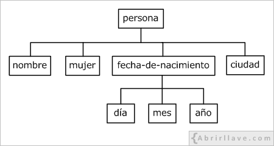

# Llenguatge de marques

## Concepte de llenguatge de marques
Un llenguatge de marcat o llenguatge de marques és una forma de codificar un document que, juntament amb el text, 
incorpora etiquetes o marques que contenen informació addicional sobre l'estructura del text o la seva presentació.

El llenguatge de marques més estès és l’HTML (HyperText Markup Language, llenguatge de marcat d’hipertext), fonament del
 World Wide Web (xarxa de comunicació d’abast mundial).
 
Alguns exemples:
 
HTML 4.0
 ```html
 <h1>Anatidae</h1>
 <p>
   The family <i>Anatidae</i> includes ducks, geese, and swans,
   but <em>not</em> the closely related screamers.
 </p>
 ```
XML
```xml
<?xml version="1.0" encoding="UTF-8"?>
<note>
  <to>Tove</to>
  <from>Jani</from>
  <heading>Reminder</heading>
  <body>Don't forget me this weekend!</body>
</note> 
```
  
## Avantatges. Necessitat d'ús

Inicialment els llenguatges de marques es van enfocar a la generació de documents però gràcies als seus avantatges
s'ha extès el seu ús envers la definició d'estructures de dades i la compartició d'informació. 

Dels avantatges destaquem:
* La facilitat de creació i lectura.
* El compliment d’estàndards d’emmagatzematge definits i públics.
* La incorporació de metadades.
* La definició de l’estructura de les dades.

## Característiques comunes
Els llenguatges de marques han destacat per una sèrie de característiques que els
han convertit en els tipus de llenguatges més usats en la informàtica actual per
emmagatzemar i representar les dades. Entre les característiques més interessants
que ofereixen els llenguatges de marques hi ha:
* Que es basen en el text pla.
* Que permeten fer servir metadades.
* Que són fàcils d’interpretar i processar.
* Que són fàcils de crear i prou flexibles per representar dades molt diverses.

Les aplicacions d’Internet i molts dels programes d’ordinador que es fan servir
habitualment fan servir d’alguna manera o altra algun llenguatge de marques.

## Identificació d'àmbits d'aplicació
Quant als àmbits d'aplicació podem definir la següent classificació:

* Documents en general:
  * Llenguatges descriptius com YAML, EBML.
  * Llenguatges de presentació com RTF, Tex, HTML
  * Llenguatges lleugers com Markdown
* Tecnologies d'internet:
  * HTML, XHTML, GladeXML, Atom, RSS, WSDL
* Lleguatges especialitzats:
  * SVG, XMPP, COLLADA 

En [Lenguaje de marcado](https://es.wikipedia.org/wiki/Lenguaje_de_marcado#Principales) trobareu més informació.

## Classificació
 
És complicat fer una classificació dels llenguatges de marques que hi ha però
generalment s’accepta que en tenim dos grans grups basant-nos en quin és
l’objectiu bàsic del llenguatge de marques:

* **Llenguatges procedimentals i de presentació**, orientats a especificar com
s’ha de representar la informació.
* **Llenguatges descriptius o semàntics**: orientats a descriure l’estructura de
les dades que conté.
Aquesta és la classificació més acceptada però, com molt sovint passa en l’àmbit
de la Informàtica, ens podem trobar llenguatges que tinguin aspectes dels dos
grups i permetin tant definir la manera de presentar la informació com definir-ne
l’estructura.

### Procedimentals i de presentació
En aquests llenguatges el que es fa és indicar de quina manera s’ha de fer
la presentació de les dades. Ja sigui per mitjà d’informació per al disseny
(marcar negretes, títols, etc.) o de procediments que ha de fer el programari de
representació. L’exemple més popular d’aquests llenguatges és l’HTML però n’hi
ha molts més: TeX, Wikitext...
En aquests casos els documents ens poden servir per determinar de quina manera
es mostrarà el document a qui el llegeixi.

##### Latex: un llenguatge de marcat procedimental
```latex
\documentclass{article}
\usepackage{graphicx}

\begin{document}

\title{Introduction to \LaTeX{}}
\author{Author's Name}

\maketitle

\begin{abstract}
The abstract text goes here.
\end{abstract}

\section{Introduction}
Here is the text of your introduction.

\begin{equation}
    \label{simple_equation}
    \alpha = \sqrt{ \beta }
\end{equation}

\subsection{Subsection Heading Here}
Write your subsection text here.

\begin{figure}
    \centering
    \includegraphics[width=3.0in]{myfigure}
    \caption{Simulation Results}
    \label{simulationfigure}
\end{figure}

\section{Conclusion}
Write your conclusion here.

\end{document}
```

### Descriptius o semàntics
En aquests llenguatges es descriu quina estructura lògica té el document ignorant
de quina manera serà representada en els programes. Només es posen les marques
amb l’objectiu de definir les parts que donen estructura al document. L’exemple
més important és l’XML però n’hi algun altre que està tenint molt de suport, com
per exemple JSON.
En el document següent tenim un exemple d’un fitxer de marques que dóna
informació sobre persones:
```xml
<alumnes>
    <persona>
        <nom>Pere</nom>
        <cognom>Puig</cognom>
    </persona>
    <persona>
        <nom>Manel</nom>
        <cognom>Garcia</cognom>
    </persona>
</alumnes>
```
Es pot veure clarament que la informació de les marques en el document estableix
quin és el contingut de les dades: una llista d’alumnes. Amb un simple cop d’ull
resulta fàcil determinar que Pere i Manel són noms i que Puig i Garcia són
cognoms. Però per mitjà de la jerarquia de les dades es pot inferir que Pere Puig
i Manel Garcia són alumnes ja que tant nom com cognom estan englobats dins
de la marca alumnes.

Aquest document mostra quina és l’estructura de les dades que conté i a més
aquesta també es pot descobrir tot interpretant les etiquetes el seu contingut
semàntic. A partir dels coneixements que es tinguin es dedueix que Pere és el
nom d’una persona que és un alumne.

En els darrers anys, s’han desenvolupat diversos llenguatges de marques senzills i poc estandarditzats per permetre 
als autors crear text formatat a través de navegadors web, com els que s’utilitzen en wikis i en fòrums web. 
De vegades s’anomenen llenguatges de marcatge lleugers. Markdown i el llenguatge de marques utilitzat per la Viquipèdia
 en són exemples.

{:.alert .alert-activity}
<div markdown="1">
### Exercicis
{: .no_toc .nocount } 

1. Compara les diverses possibilitats d'exportació, a l'hora de guardar un document en LibreOffice Writer.

2. Escriu en un fitxer de text pla el següent:
	```html
	<h1> encapçalat de nivell 1 </h1>
	<h3> encapçalat de nivell 3 </h3>
	```
Obri este fitxer des del navegador. Còm es veu?
Canvia-li la extensió del fitxer per html. Canvia la visualització?

3. Busca en Internet una classificació de llenguatges de marques. Indica 3 exemples de cada tipus indicant el seu ús
principal.

4. Entra en [openclipart.org](https://openclipart.org), cerca "8 ball", descarrega la imatge més senzilla que veges. Obre-la amb l'editor de text.
Pots intuir l'esctructura? Mira de canviar el color de la bola des de l'editor (pista: els colors tenen el format: #000000).
</div>

## XML

XML (_eXtensible Markup Language_, Llenguatge de Marcat extensible) és un llenguatge
desenvolupat per W3C (World Wide Web Consortium) que està basat en SGML (_Standard
Generalized Markup Language_, Llenguatge de Marcat Generalitzat Estàndard).

XML és un llenguatge utilitzat per a l'emmagatzematge i intercanvi de dades estructurades entre diferents plataformes.

XML és un metallenguatge, és a dir, pot ser emprat per a definir altres llenguatges, anomenats *dialectes XML*.
 Per exemple, alguns llenguatges basats en XML són:
* GML (_Geography Markup Language_, Llenguatge de Marcat Geogràfic).
* MathML (_Mathematical Markup Language_, Llenguatge de Marcat Matemàtic).
* RSS (_Really Simple Syndication_, Sindicació Realment Simple).
* SVG (_Scalable Vector Graphics_, Gràfics vectorials escalables).
* XHTML (_eXtensible HyperText Markup Language_, Llenguatge de Marcat d'Hipertext extensible).

### Estructura i sintaxi

Els documents XML estan formats per text pla (sense format) i contenen marques (etiquetes) definides pel desenvolupador.
**Cada etiqueta representa un element**. Aquestes marques, és recomanable que siguen el més descriptives possible i, per escriure-les, s'utilitzen els caràcters
 menor que "<", major que ">" i barra inclinada (_slash_) "/".

Si en un document XML es vol guardar el nom Elsa, es pot escriure:
```xml
<nom> Elsa </nom>
```
La sintaxi utilitzada en l'exemple és la bàsica per escriure un element en XML:

```xml
<etiqueta> valor </etiqueta>
```
Cal observar que, entre l'etiqueta d'inici (`<nom>`) i l'etiqueta de fi (`</ nom>`) s'ha escrit la dada (`valor`) que es 
vol emmagatzemar. En aquest cas `Elsa`. 

### Elements buits

En un document XML, un element pot no contenir cap valor. En aquest cas cal escriure:

```xml
<etiqueta> </ etiqueta>
```
Es pot expressar el mateix escrivint:
```xml
<etiqueta />
```

Per escriure l'element `nom` buit, es pot escriure:
```xml
<nom> </nom>
```
O també:

```xml
<nom />
```
### Relacions pare-fill entre elements

D'altra banda, un element (pare) pot contenir a un altre o altres elements (fills):

```xml
<persona>
   <nom> Elsa </ nom>
   <dona />
   <data-de-naixement>
      <dia> 18 </ dia>
      <mes> 6 </ mes>
      <any> 1996 </ any>
   </ data-de-naixement>
   <ciutat> Pamplona </ ciutat>
</ persona>
```

En aquest exemple, l'element "persona" conté quatre elements (fills): "nom", "dona", "data de naixement" i "ciutat". 
I l'element "data de naixement" conté altres tres elements (fills): "dia", "mes" i "any".

Vegeu que, de tots els elements que apareixen en aquest exemple, només l'element "dona" està buit.

### Element arrel d'un document XML

Tot document XML ha de tenir un únic element arrel (pare) del que descendiran tots els altres. En aquest cas, 
l'element arrel és "persona". Gràficament, l'estructura d'elements d'aquest document es pot representar com es mostra 
a continuació:



D'aquesta manera, l'estructura de qualsevol document XML es pot representar com un arbre invertit d'elements. 
Es diu que els elements són els que donen estructura semàntica a el document.

### Elements amb contingut mixt

Un element pot contenir contingut mixt, és a dir, text i altres elements:

```xml
<persona>
   <nom>Elsa</ nom> viu a <ciutat>Pamplona</ ciutat>.
</ persona>
```
En aquest exemple, l'element "persona" conté els elements "nom" i "ciutat", a més dels textos "viu en" i ".".

### Normes de sintaxi bàsiques en XML

En un document XML, tots els noms dels elements són _case sensitive_, és a dir, sensibles a lletres minúscules i 
majúscules, havent de complir les següents normes:

>>Poden contenir lletres minúscules, lletres majúscules, números, punts ".", Guions mitjans "-" i guions baixos "_".

>>Així mateix, poden contenir el caràcter dos punts ":". No obstant això, el seu ús es reserva per quan es 
 defineixin espais de noms.

>>El primer caràcter ha de ser una lletra o un guió baix "_".

D'altra banda, cal tenir en compte que darrere del nom d'una etiqueta es permet escriure un espai en blanc o un salt 
de línia. Per exemple, sintàcticament és correcte escriure:

```xml
<ciutat> Pamplona </ ciutat
>
```

Ara bé, no hi pot haver un salt de línia o un espai en blanc abans del nom d'una etiqueta:

```xml
<
ciutat> Pamplona </ ciutat>
```
Els següents elements no estan escrits correctament per incomplir alguna regla de sintaxi:

```xml
<ciudad>Pamplona</ciudad>
<día>18</dia>
<mes>6<mes/>
<ciudad>Pamplona</finciudad>
<_rojo>
<2colores>Rojo y Naranja</2colores>
< Aficiones >Cine, Bailar, Nadar</ Aficiones >
<persona><nombre>Elsa</persona></nombre>
<color favorito>azul</color favorito>
```
S'hauria d'escriure:

```xml
<ciudad>Pamplona</ciudad>
<día>18</día>
<mes>6</mes>
<ciudad>Pamplona</ciudad>
<_rojo/>
<colores2>Rojo y Naranja</colores2>
<Aficiones >Cine, Bailar, Nadar</Aficiones >
<persona><nombre>Elsa</nombre></persona>
<color.favorito>azul</color.favorito>
<color-favorito>azul</color-favorito>
<color_favorito>azul</color_favorito>
```
Les lletres no angleses (á, Á, ñ, Ñ ...) estan permeses. No obstant això, és recomanable no utilitzar-les per 
reduir possibles incompatibilitats amb programes que puguin no reconèixer-les.

Pel que fa al caràcter guió "-" i a punt ".", Encara que també estan permesos per nomenar etiquetes, 
igualment s'aconsella evitar el seu ús; el guió perquè podria confondre amb el signe menys, i el punt perquè, 
per exemple a l'escriure color.favorito, podria interpretar-se que favorito és una propietat de l'objecte color.

{:.alert .alert-activity }
<div markdown="1">
### Activitat 2. Errors de sintaxi
{: .no_toc .nocount } 

Revisa el següent document XML, detecta els errors i reescriu-lo correctament
```xml
<?xml version="1.0" encoding="UTF-8"?>
<frutas>  
</frutas>
< frutas >
   < fruta >
      < nombre >cereza< nombre \>
   < fruta \>
   < fruta >
      < nombre >naranja< nombre \>
   < fruta \>
< frutas \>
```
</div>

### Ferramentes d'edició

### Elaboració de documents XML ben formats

### Utilització d'espais de noms en XML

## Bibliografia i crèdits

* Wikipedia contributors. (2020, September 13). Markup language. _In Wikipedia, The Free Encyclopedia._ 
Retrieved 15:51, September 15, 2020, from 
[https://en.wikipedia.org/w/index.php?title=Markup_language&oldid=978142210](https://en.wikipedia.org/w/index.php?title=Markup_language&oldid=978142210)
* Carlos Pes. (Febrer de 2017). _Lenguajes de Marcas y Sistemas de Gestión de Información (LMSGI)  disponible en 
[Tutorial de LMSGI](http://www.abrirllave.com/lmsgi/) 


