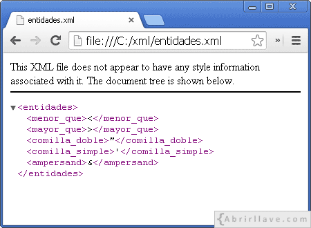
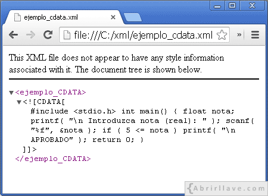

# Llenguatge de marques
{: .no_toc }

1. TOC
{:toc}

## Concepte de llenguatge de marques
Un llenguatge de marcat o llenguatge de marques és una forma de codificar un document que, juntament amb el text, 
incorpora etiquetes o marques que contenen informació addicional sobre l'estructura del text o la seva presentació.

El llenguatge de marques més estès és l’HTML (HyperText Markup Language, llenguatge de marcat d’hipertext), fonament del
 World Wide Web (xarxa de comunicació d’abast mundial).
 
Alguns exemples:
 
HTML 4.0
 ```html
 <h1>Anatidae</h1>
 <p>
   The family <i>Anatidae</i> includes ducks, geese, and swans,
   but <em>not</em> the closely related screamers.
 </p>
 ```
XML
```xml
<?xml version="1.0" encoding="UTF-8"?>
<note>
  <to>Tove</to>
  <from>Jani</from>
  <heading>Reminder</heading>
  <body>Don't forget me this weekend!</body>
</note> 
```
  
## Avantatges. Necessitat d'ús

Inicialment els llenguatges de marques es van enfocar a la generació de documents però gràcies als seus avantatges
s'ha extès el seu ús envers la definició d'estructures de dades i la compartició d'informació. 

Dels avantatges destaquem:
* La facilitat de creació i lectura.
* El compliment d’estàndards d’emmagatzematge definits i públics.
* La incorporació de metadades.
* La definició de l’estructura de les dades.

## Característiques comunes
Els llenguatges de marques han destacat per una sèrie de característiques que els
han convertit en els tipus de llenguatges més usats en la informàtica actual per
emmagatzemar i representar les dades. Entre les característiques més interessants
que ofereixen els llenguatges de marques hi ha:
* Que es basen en el text pla.
* Que permeten fer servir metadades.
* Que són fàcils d’interpretar i processar.
* Que són fàcils de crear i prou flexibles per representar dades molt diverses.

Les aplicacions d’Internet i molts dels programes d’ordinador que es fan servir
habitualment fan servir d’alguna manera o altra algun llenguatge de marques.

## Identificació d'àmbits d'aplicació
Quant als àmbits d'aplicació podem definir la següent classificació:

* Documents en general:
  * Llenguatges descriptius com YAML, EBML.
  * Llenguatges de presentació com RTF, Tex, HTML
  * Llenguatges lleugers com Markdown
* Tecnologies d'internet:
  * HTML, XHTML, GladeXML, Atom, RSS, WSDL
* Lleguatges especialitzats:
  * SVG, XMPP, COLLADA 

En [Lenguaje de marcado](https://es.wikipedia.org/wiki/Lenguaje_de_marcado#Principales) trobareu més informació.

## Classificació
 
És complicat fer una classificació dels llenguatges de marques que hi ha però
generalment s’accepta que en tenim dos grans grups basant-nos en quin és
l’objectiu bàsic del llenguatge de marques:

* **Llenguatges procedimentals i de presentació**, orientats a especificar com
s’ha de representar la informació.
* **Llenguatges descriptius o semàntics**: orientats a descriure l’estructura de
les dades que conté.
Aquesta és la classificació més acceptada però, com molt sovint passa en l’àmbit
de la Informàtica, ens podem trobar llenguatges que tinguin aspectes dels dos
grups i permetin tant definir la manera de presentar la informació com definir-ne
l’estructura.

### Procedimentals i de presentació
En aquests llenguatges el que es fa és indicar de quina manera s’ha de fer
la presentació de les dades. Ja sigui per mitjà d’informació per al disseny
(marcar negretes, títols, etc.) o de procediments que ha de fer el programari de
representació. L’exemple més popular d’aquests llenguatges és l’HTML però n’hi
ha molts més: TeX, Wikitext...
En aquests casos els documents ens poden servir per determinar de quina manera
es mostrarà el document a qui el llegeixi.

##### Latex: un llenguatge de marcat procedimental
```latex
\documentclass{article}
\usepackage{graphicx}

\begin{document}

\title{Introduction to \LaTeX{}}
\author{Author's Name}

\maketitle

\begin{abstract}
The abstract text goes here.
\end{abstract}

\section{Introduction}
Here is the text of your introduction.

\begin{equation}
    \label{simple_equation}
    \alpha = \sqrt{ \beta }
\end{equation}

\subsection{Subsection Heading Here}
Write your subsection text here.

\begin{figure}
    \centering
    \includegraphics[width=3.0in]{myfigure}
    \caption{Simulation Results}
    \label{simulationfigure}
\end{figure}

\section{Conclusion}
Write your conclusion here.

\end{document}
```

### Descriptius o semàntics
En aquests llenguatges es descriu quina estructura lògica té el document ignorant
de quina manera serà representada en els programes. Només es posen les marques
amb l’objectiu de definir les parts que donen estructura al document. L’exemple
més important és l’XML però n’hi algun altre que està tenint molt de suport, com
per exemple JSON.
En el document següent tenim un exemple d’un fitxer de marques que dóna
informació sobre persones:
```xml
<alumnes>
    <persona>
        <nom>Pere</nom>
        <cognom>Puig</cognom>
    </persona>
    <persona>
        <nom>Manel</nom>
        <cognom>Garcia</cognom>
    </persona>
</alumnes>
```
Es pot veure clarament que la informació de les marques en el document estableix
quin és el contingut de les dades: una llista d’alumnes. Amb un simple cop d’ull
resulta fàcil determinar que Pere i Manel són noms i que Puig i Garcia són
cognoms. Però per mitjà de la jerarquia de les dades es pot inferir que Pere Puig
i Manel Garcia són alumnes ja que tant nom com cognom estan englobats dins
de la marca alumnes.

Aquest document mostra quina és l’estructura de les dades que conté i a més
aquesta també es pot descobrir tot interpretant les etiquetes el seu contingut
semàntic. A partir dels coneixements que es tinguin es dedueix que Pere és el
nom d’una persona que és un alumne.

En els darrers anys, s’han desenvolupat diversos llenguatges de marques senzills i poc estandarditzats per permetre 
als autors crear text formatat a través de navegadors web, com els que s’utilitzen en wikis i en fòrums web. 
De vegades s’anomenen llenguatges de marcatge lleugers. Markdown i el llenguatge de marques utilitzat per la Viquipèdia
 en són exemples.

{:.alert .alert-activity}
<div markdown="1">
### Activitat 1. Exercicis
{: .no_toc .nocount } 

1. Compara les diverses possibilitats d'exportació, a l'hora de guardar un document en LibreOffice Writer.

2. Escriu en un fitxer de text pla el següent:
	```html
	<h1> encapçalat de nivell 1 </h1>
	<h3> encapçalat de nivell 3 </h3>
	```
Obri este fitxer des del navegador. Còm es veu?
Canvia-li la extensió del fitxer per html. Canvia la visualització?

3. Busca en Internet una classificació de llenguatges de marques. Indica 3 exemples de cada tipus indicant el seu ús
principal.

4. Entra en [openclipart.org](https://openclipart.org), cerca "8 ball", descarrega la imatge més senzilla que veges. Obre-la amb l'editor de text.
Pots intuir l'esctructura? Mira de canviar el color de la bola des de l'editor (pista: els colors tenen el format: #000000).
</div>

## XML

XML (_eXtensible Markup Language_, Llenguatge de Marcat extensible) és un llenguatge
desenvolupat per W3C (World Wide Web Consortium) que està basat en SGML (_Standard
Generalized Markup Language_, Llenguatge de Marcat Generalitzat Estàndard).

XML és un llenguatge utilitzat per a l'emmagatzematge i intercanvi de dades estructurades entre diferents plataformes.

XML és un metallenguatge, és a dir, pot ser emprat per a definir altres llenguatges, anomenats *dialectes XML*.
 Per exemple, alguns llenguatges basats en XML són:
* GML (_Geography Markup Language_, Llenguatge de Marcat Geogràfic).
* MathML (_Mathematical Markup Language_, Llenguatge de Marcat Matemàtic).
* RSS (_Really Simple Syndication_, Sindicació Realment Simple).
* SVG (_Scalable Vector Graphics_, Gràfics vectorials escalables).
* XHTML (_eXtensible HyperText Markup Language_, Llenguatge de Marcat d'Hipertext extensible).

### Estructura i sintaxi

Els documents XML estan formats per text pla (sense format) i contenen marques (etiquetes) definides pel desenvolupador.
**Cada etiqueta representa un element**. Aquestes marques, és recomanable que siguen el més descriptives possible i, per escriure-les, s'utilitzen els caràcters
 menor que "<", major que ">" i barra inclinada (_slash_) "/".

Si en un document XML es vol guardar el nom Elsa, es pot escriure:
```xml
<nom> Elsa </nom>
```
La sintaxi utilitzada en l'exemple és la bàsica per escriure un element en XML:

```xml
<etiqueta> valor </etiqueta>
```
Cal observar que, entre l'etiqueta d'inici (`<nom>`) i l'etiqueta de fi (`</ nom>`) s'ha escrit la dada (`valor`) que es 
vol emmagatzemar. En aquest cas `Elsa`. 

### Elements buits

En un document XML, un element pot no contenir cap valor. En aquest cas cal escriure:

```xml
<etiqueta> </ etiqueta>
```
Es pot expressar el mateix escrivint:
```xml
<etiqueta />
```

Per escriure l'element `nom` buit, es pot escriure:
```xml
<nom> </nom>
```
O també:

```xml
<nom />
```
### Relacions pare-fill entre elements

D'altra banda, un element (pare) pot contenir a un altre o altres elements (fills):

```xml
<persona>
   <nom> Elsa </ nom>
   <dona />
   <data-de-naixement>
      <dia> 18 </ dia>
      <mes> 6 </ mes>
      <any> 1996 </ any>
   </ data-de-naixement>
   <ciutat> Pamplona </ ciutat>
</ persona>
```

En aquest exemple, l'element "persona" conté quatre elements (fills): "nom", "dona", "data de naixement" i "ciutat". 
I l'element "data de naixement" conté altres tres elements (fills): "dia", "mes" i "any".

Vegeu que, de tots els elements que apareixen en aquest exemple, només l'element "dona" està buit.

### Element arrel d'un document XML

Tot document XML ha de tenir un únic element arrel (pare) del que descendiran tots els altres. En aquest cas, 
l'element arrel és "persona". Gràficament, l'estructura d'elements d'aquest document es pot representar com es mostra 
a continuació:


D'aquesta manera, l'estructura de qualsevol document XML es pot representar com un arbre invertit d'elements. 
Es diu que els elements són els que donen estructura semàntica a el document.

### Elements amb contingut mixt

Un element pot contenir contingut mixt, és a dir, text i altres elements:

```xml
<persona>
   <nom>Elsa</ nom> viu a <ciutat>Pamplona</ ciutat>.
</ persona>
```
En aquest exemple, l'element "persona" conté els elements "nom" i "ciutat", a més dels textos "viu en" i ".".

### Normes de sintaxi bàsiques en XML

En un document XML, tots els noms dels elements són _case sensitive_, és a dir, sensibles a lletres minúscules i 
majúscules, havent de complir les següents normes:

>>Poden contenir lletres minúscules, lletres majúscules, números, punts ".", Guions mitjans "-" i guions baixos "_".

>>Així mateix, poden contenir el caràcter dos punts ":". No obstant això, el seu ús es reserva per quan es 
 defineixin espais de noms.

>>El primer caràcter ha de ser una lletra o un guió baix "_".

D'altra banda, cal tenir en compte que darrere del nom d'una etiqueta es permet escriure un espai en blanc o un salt 
de línia. Per exemple, sintàcticament és correcte escriure:

```xml
<ciutat> Pamplona </ ciutat
>
```

Ara bé, no hi pot haver un salt de línia o un espai en blanc abans del nom d'una etiqueta:

```xml
<
ciutat> Pamplona </ ciutat>
```
Els següents elements no estan escrits correctament per incomplir alguna regla de sintaxi:

```xml
<ciudad>Pamplona</ciudad>
<día>18</dia>
<mes>6<mes/>
<ciudad>Pamplona</finciudad>
<_rojo>
<2colores>Rojo y Naranja</2colores>
< Aficiones >Cine, Bailar, Nadar</ Aficiones >
<persona><nombre>Elsa</persona></nombre>
<color favorito>azul</color favorito>
```
S'hauria d'escriure:

```xml
<ciudad>Pamplona</ciudad>
<día>18</día>
<mes>6</mes>
<ciudad>Pamplona</ciudad>
<_rojo/>
<colores2>Rojo y Naranja</colores2>
<Aficiones >Cine, Bailar, Nadar</Aficiones >
<persona><nombre>Elsa</nombre></persona>
<color.favorito>azul</color.favorito>
<color-favorito>azul</color-favorito>
<color_favorito>azul</color_favorito>
```
Les lletres no angleses (á, Á, ñ, Ñ ...) estan permeses. No obstant això, és recomanable no utilitzar-les per 
reduir possibles incompatibilitats amb programes que puguin no reconèixer-les.

Pel que fa al caràcter guió "-" i a punt ".", Encara que també estan permesos per nomenar etiquetes, 
igualment s'aconsella evitar el seu ús; el guió perquè podria confondre amb el signe menys, i el punt perquè, 
per exemple a l'escriure color.favorito, podria interpretar-se que favorito és una propietat de l'objecte color.

{:.alert .alert-activity }
<div markdown="1">
### Activitat 2. Errors de sintaxi
{: .no_toc .nocount } 

Revisa el següent document XML, detecta els errors i reescriu-lo correctament
```xml
<?xml version="1.0" encoding="UTF-8"?>
<frutas>  
</frutas>
< frutas >
   < fruta >
      < nombre >cereza< nombre \>
   < fruta \>
   < fruta >
      < nombre >naranja< nombre \>
   < fruta \>
< frutas \>
```
</div>


### Atributs en XML

Els elements d'un document XML poden tenir atributs definits en l'etiqueta d'inici. Un atribut serveix per proporcionar
 informació extra sobre l'element que el conté.

Donats els següents dades d'un producte:

* Codi: G45
* Nom: Barret de llana
* Color: negre
* Preu: 12.56

La seva representació en un document XML podria ser, per exemple:
```xml
<producte cod = "G45">
   <nom color = "negre" preu = "12.56"> Barret de llana </ nom>
</ producte>
```
En aquest exemple s'han escrit tres atributs: codi, color i preu. Cal observar que, els seus valors ( "G45", 
"negre" i "12.56") s'han escrit entre cometes dobles ("). Tanmateix, també poden anar entre cometes simples ( ').

Si, per exemple, l'atribut `codi` es volgués representar com un element, es podria escriure:

```xml
<producte>
   <codi> G45 </ codi>
   <nom color="negre" preu="12.56">Barret de llana</ nom>
</ producte>
```
Com es pot apreciar, ara el valor del codi no s'ha escrit entre cometes dobles.

#### Normes de sintaxi

Els noms dels atributs han de complir les mateixes normes de sintaxi que els noms dels elements. A més, tots els
 atributs d'un element han de ser únics. Per exemple, és incorrecte escriure:

```
<dades x="3" x="4" i="5" />
```

No obstant això, sí que és correcte escriure:

```xml
<dades x="3" X="4" i="5" />
```
Els atributs continguts en un element, com en aquest cas x, X i y, han de separar amb espais en blanc, i no és 
significatiu el seu ordre.

{:.alert .alert-activity }
<div markdown="1">
### Activitat 3. Creació de documents XML
{: .no_toc .nocount }
Escriu un document XML que emmagatzeme la següent informació:

#### Ciutats     
{: .no_toc }

| Nom |	País | Continent |
| --- | ---- | --------- | 
| Nueva Delhi | India  | Àsia |
| Lisboa | Portugal | Europa |
| El Cairo | Egipto | África |

Nota: el continent es respresentarà mitjançant un atribut. 


#### Fets històrics
{: .no_toc }

<div markdown="0">
<table>
<tr>
    <th rowspan="2"> Descripció de cada  fet</th><th colspan="3"> Data </th> 
</tr> 
<tr>
    <th>Dia</th><th>Mes</th><th>Any</th>
 </tr>
<tr><td>IBM dóna a conèixer el PC. </td><td>  12 </td><td>  8  </td><td> 1981 </td></tr>
<tr>
    <td>Es funda Google</td>
    <td>4</td> <td>  9 </td><td>1998 </td>
</tr>
<tr><td>Es funda Facebook.</td><td> 4 </td><td>  2 </td><td> 2004 </td></tr>
</table>
</div>
Nota: la descripció de cada fet cal representar-la mitjançant un atribut, la resta d'informació no. 

</div>

### Declaració XML

La declaració XML que es pot escriure al principi d’un document XML comença amb els caràcters "<?" i acaba amb "?>". 

#### Versió i codificació 

Un document XML podria contenir la següent declaració XML:

```xml
<?xml version="1.0" encoding="UTF-8"?>
```
En aquesta declaració XML, està indicant que 1.0 és la versió de XML utilitzada en el document i UTF-8 
(8-bit _Unicode Transformation Format_, Formato de Transformación Unicode de 8 bits) és la codificació de caràcters 
empleada.

En un document XML no és obligatori que aparega la declaració XML. Ara bé, si la inclou, ha d'aparèixer en la primera 
línia del document, i el caràcter "<" ha de ser el primer de dita línia, és dir, abans no poden aparèixer espais en blanc.

#### Atribut _standalone_

En una declaració XML, a més de la versió i la codificació dels atributs, també es pot escriure l’atribut `standalone`,
 que pot prendre dos valors ("yes" o "no"):

```xml
<?xml version= "1.0" encoding="UTF-8" standalone="yes"?>
```
En escriure `standalone="yes"` s'està indicant que el document és independent d'altres, com per exemple d'una 
DTD (_Document Type Definition_, Definició de Tipo de Documento) externa (o vorem més endavant). En cas contrari, 
significarà que el document no és independent.

En un document XML, escriure la declaració XML és opcional. Pero, si s'escriu, l'atribut `version` és obligatori.
No obstant, els atributs `encoding` i `standalone` són opcionals i, per defecte, els seus valors són "UTF-8" i "no", 
respectivament.

Per una altra part, quan s’escriu l’atribut `encoding`, sempre haurà d’aparèixer després de la versió. I, l'atribut
`standalone`, sempre que existisca, haurá d'estar en l'últim lloc.
 
### Referència a altres entitats

En XML alguns caràcters que són especials pel seu significat (veure taula) i, per escriure'ls en un document XML, es poden utilitzar
 les referències a entitats mostrades en la següent taula:

| Carácter |	Entidad |	Referencia a entidad
| -- | -- | :--: |
| < (menor que)	| lt (_less than_) |	`&lt;`
| > (mayor que)	| gt (_greater than_)	| `&gt;`
| " (comilla doble)	| quot (_quotation mark_) | `&quot;`
| ' (comilla simple) | apos (_apostrophe_) | `&apos;`
| & (ampersand) |	amp (_ampersand_) |	`&amp;`

Donat l'arxiu "entidades.xml":

```xml
<?xml version="1.0" encoding="UTF-8"?>
<entidades>
   <menor_que>&lt;</menor_que>
   <mayor_que>&gt;</mayor_que>
   <comilla_doble>&quot;</comilla_doble>
   <comilla_simple>&apos;</comilla_simple>
   <ampersand>&amp;</ampersand>
</entidades>
```

En obrir-lo en Google Chrome es podrà visualitzar:



Al navegador web, es pot veure que on s'han escrit les referències a entitats en el document XML (per exemple), 
es mostren els caràcters corresponents (per exemple <).

#### Caràcters problemàtics en XML: menor que (<) i ampersand (&)

En un document XML, el caràcter "<" és problemàtic perquè indica el començament d'una etiqueta. Per tant, 
en comptes d'escriure, per exemple:

```xml
<condicion>a<b</condicion>
```
Caldria utilitzar la referència a entitat escrivint:

```xml
<condicion>a&lt;b</condicion>
```
El caràcter ">" sí que pot utilitzar-se en el text contingut en un element, i no és incorrecte escriure, per exemple:

```xml
<condicion>a>b</condicion>
```
Ara bé, es recomana fer ús de la seva referència a entitat (`&gt;`)

En un document XML, el caràcter _ampersand_ també és problemàtic, ja que s'utilitza per indicar el començament d'una 
referència a entitat. Per exemple, no és correcte escriure:
```xml
<condicion>a==1 && b==2</condicion>
```
En el seu lloc s'ha d'escriure el següent:
```xml
<condicion>a==1 &amp;&amp; b==2</condicion>
```

#### Ús de la cometa doble ( ") i de la cometa simple ( ') en atributs

Si el valor d'un atribut s'escriu entre cometes dobles ( "), aquest valor no podrà contenir aquest caràcter. 
Per exemple, no és correcte escriure:

```
<dato caracter="comilla doble(")"/>
```

Per a això, cal utilitzar la referència a entitat com es mostra a continuació:

```xml
<dato caracter="comilla doble(&quot;)"/>
```

De la mateixa manera passa amb la cometa simple ( '), sent incorrecte escriure, per exemple:

```
<dato caracter='comilla simple(')'/>
```

Pel que, en aquest cas, caldria usar com es mostra tot seguit:

```xml
<dato caracter='comilla simple(&apos;)'/>
```

D'altra banda, els valors d'atributs escrits entre cometes dobles ( ") sí que poden contenir el caràcter cometa simple
 ( ') i al revés. Per exemple, és correcte escriure:

```xml
<dato caracter="comilla simple(')"/>
<dato caracter='comilla doble(")'/>
```

En aquests casos, *no és obligatori fer servir les referències a entitats, però sí recomanable*.


### Referències de caràcters en XML

En un document XML es poden escriure referències de caràcters Unicode amb els símbols & #, seguits de la valor decimal
 o hexadecimal de l'caràcter Unicode que es vulgui representar i, finalment, afegint el caràcter punt i coma ";".

Representació del caràcter Euro (€) en XML

Donat el document XML "productos.xml":

```xml
<?xml version="1.0" encoding="UTF-8"?>
<productos>
   <nombre precio="12.56&#8364;">Gorro de lana</nombre>
   <nombre precio="16.99&#x20AC;">Gorro polar</nombre>
</productos>
```

En visualitzar en un navegador web, es podrà veure el següent:


Cal observar que, en aquest cas, per representar el símbol de l'Euro (€), la primera vegada s'ha utilitzat el seu valor 
decimal (`&#8364`) en Unicode i, la segona vegada, el seu valor hexadecimal (`&#x20AC`).

### Comentaris en XML


Per escriure comentaris en un document XML, aquests s'han d'escriure entre els caràcters "<!-" i "->". Per exemple:

```xml
<!- Això és un comentari escrit en un document XML ->
```
Donat el fitxer XML "letras.xml":
```xml
<?xml version="1.0" encoding="UTF-8"?>
<!--Ejemplo uso de comentarios.-->
<a>
   <b>
      <c cantidad="4">cccc</c>
      <d cantidad="2">dd</d>
   </b>
   <e>
      <f cantidad="8">ffffffff</f>
      <!--g puede aparecer varias veces.-->
      <g cantidad="5">ggggg</g>
      <g cantidad="2">gg</g>
   </e>
</a>
```
En un navegador es veurà:


En un document XML, no es poden escriure comentaris dins de les etiquetes. Per exemple, no és correcte escriure:

```xml
<element <!-- element buit -> />
```
D'altra banda, cal tenir en compte que en els comentaris d'un document XML no està permès utilitzar dos guions seguits:

```xml
<!-- dos guions seguits -- en un comentari dóna error ->
```

De manera que, no és possible niar comentaris en un document XML.

### Seccions CDATA en XML

Un document XML pot contenir seccions CDATA (_Character DATA_) per escriure text que no es desitja que sigui analitzat. 
Per exemple, això pot ser útil quan es vol escriure text que continga algun dels caràcters problemàtics: menor que `<` 
o ampersand `&`.

En un document XML, per incloure una secció CDATA, s'escriu començant amb la cadena de caràcters 
"<! [CDATA [" i acabant amb els caràcters "]]>".

Una secció CDATA pot contenir, per exemple, el codi font d'un programa escrit en llenguatge C:

```xml
<?xml version="1.0" encoding="UTF-8"?>
<ejemplo_CDATA>
<![CDATA[
#include <stdio.h>
int main()
{
   float nota;
   printf( "\n   Introduzca nota (real): " );
   scanf( "%f", &nota );
   if ( 5 <= nota )
      printf( "\n   APROBADO" );
   return 0;
}
]]>
</ejemplo_CDATA>
```
En un navegador web es visualitzarà cosa semblant a:



Dins d'una secció CDATA no es pot escriure la cadena "]]>". En conseqüència, no es poden niar seccions CDATA.

D'altra banda, no està permès escriure espais en blanc o salts de línia en les cadenes d'inici "<! [CDATA [" o fi "]]>" 
d'una secció CDATA

### Ferramentes d'edició
Per a editar documents XML és suficient en disposar d'un editor de text pla, com Pluma o GEdit.

### Elaboració de documents XML ben formats

Es diu que un document XML està ben format (well-formed document) quan no té errors de sintaxi. Això inclou els
 següents aspectes:

 * Els noms dels elements i els seus atributs han d'estar escrits correctament.
 * Els valors dels atributs han d'estar escrits entre cometes dobles o simples.
 * Els atributs d'un element s'han de separar amb espais en blanc.
 * S'han d'utilitzar referències a entitats on sigui necessari.
 * Hi ha d'haver un únic element arrel.
 * Tot element ha de tenir un element pare, excepte l'element arrel.
 * Tots els elements han de tenir una etiqueta d'obertura i una altra de tancament.
 * Les etiquetes han d'estar correctament niades.
 * Les instruccions de procés s'han d'escriure de forma correcta.
 * La declaració XML ha d'estar en la primera línia escrita correctament.
 * Les seccions `CDATA` i els comentaris han d'estar correctament escrits.

### Utilització d'espais de noms en XML

## Bibliografia i crèdits

* Wikipedia contributors. (2020, September 13). Markup language. _In Wikipedia, The Free Encyclopedia._ 
Retrieved 15:51, September 15, 2020, from 
[https://en.wikipedia.org/w/index.php?title=Markup_language&oldid=978142210](https://en.wikipedia.org/w/index.php?title=Markup_language&oldid=978142210)
* Carlos Pes. (Febrer de 2017). _Lenguajes de Marcas y Sistemas de Gestión de Información (LMSGI)  disponible en 
[Tutorial de LMSGI](http://www.abrirllave.com/lmsgi/) 


