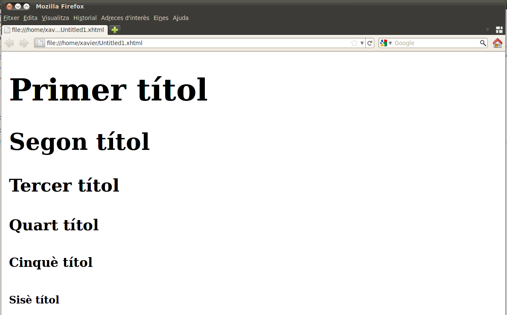

# Utilització de llenguatges de marques en entorns web
{: .no_toc }

1. TOC
{:toc}

## Introducció
A pesar que es pot representar la informació fent servir XML i CSS, el més habitual sol ser representar-la en algun 
tipus de llenguatge de marques que estigui pensat per a la representació. El llenguatge de marques per excel·lència 
a l’hora de presentar la informació és l’HTML (hypertext markup language).

L’HTML va sorgir durant el 1989 quan Tim Berners-Lee va proposar un sistema d’hipertext per compartir documents 
científics per mitjà d’Internet perquè poguessin ser visualitzats des de diferents sistemes.


> L'HTML és un llenguatge de marques que permet publicar informació molt diversa pensant en l’estructura dels documents 
i en com es representaran les dades que contenen. Ha tingut tant d’èxit que pràcticament s’ha convertit en una forma de
 comunicació universal.


L’HTML és una recomanació del W3C. El gran èxit que ha tingut ha provocat que n’hagin sortit diverses versions al 
llarg dels anys per intentar adaptar-se a les noves demandes dels usuaris.

{: .alert .alert-info}
<div markdown="1">

### HTML5
{: .nocount .no_toc }

Des de la publicació de l’HTML 4.01 (1999), l’activitat de millora de l’HTML es van aturar perquè el W3C es va centrar 
en l’XHTML, ja que la intenció era que l’XHTML substituís completament l’HTML.

Com a resposta a la lentitud en els canvis en l’HTML, una sèrie d’empreses pel seu compte (Mozilla, Apple i Opera) 
van crear el WHATWG (_Web Hypertext Application Technology Working Group_), que es va centrar en crear l’HTML5. 
Des del 2007 el W3C torna a definir les recomanacions d’HTML.

L’objectiu fonamental de l’HTML5 és suportar les darreres tecnologies multimèdia mentre es manté el llenguatge de 
marques fàcil de llegir per als humans i fàcil d’entendre per als programes i dispositius. 
En podeu trobar més informació en els enllaços següents:

 * www.w3.org/TR/html5
 * whatwg.org/html
</div>

## HTML

L’HTML està pensat per definir l’estructura d’un document de text a partir d’una sèrie d’etiquetes predefinides 
formades per un nom envoltat dels símbols `<` i `>`. Cada una de les etiquetes servirà per definir l’estructura d’un 
document a part d’aportar-li informació semàntica sobre el contingut respecte al document.

En les primeres versions, algunes de les etiquetes i propietats estaven pensades també per marcar quina seria la 
manera en què es representaria la informació, però actualment s’ha eliminat de l’estàndard.

>> Actualment la creació d’una pàgina web consistirà a definir l’estructura del document per mitjà d’HTML i definir-ne 
el format per mitjà dels fulls d’estil CSS.

La separació de la informació de l’estructura de les dades és un dels components clau per donar dinamisme a les pàgines web.

### Definició de l'estructura d'un document

Si s’analitza un document de text a grans trets podem veure que té una estructura definida. Primer hi sol haver títols, 
text repartit en paràgrafs, imatges….


Aquestes parts són fàcils de detectar per una persona però no és igual de senzill que un programa ho puga fer. 
L’HTML intenta definir l’estructura d’un document de manera que siga senzill per a un programa interpretar què 
són cada una de les dades que va trobant. Per fer-ho fa servir tota una sèrie d’etiquetes que indicaran quin és el 
paper que tenen cada una de les dades en el document.

S’han definit etiquetes per marcar cada una de les seccions en què podem definir un document.

#### Esquema bàsic d'un document HTML

Els documents HTML només tenen una arrel, que serà l’element `<html>`. Aquesta etiqueta es fa servir per informar a 
qui llija el document que el contingut del document és un fitxer HTML.

L’arrel només pot tenir dos elements fills:

 * `<head>`: és el lloc en el qual es pot posar informació sobre el document HTML (metadades). El títol, el creador, 
 l’idioma, el full d’estil, etc. Molta d’aquesta informació no es visualitzarà en el navegador. En la capçalera hi ha un
  element obligatori, `<title>`, en el qual s’especificarà el nom del document.
 * `<body>`: conté el contingut i l’estructura del document. Són les parts que es “veuen” en visualitzar el document HTML.

#### Declaració DOCTYPE

Segons els estàndards HTML cada document necessita una declaració del tipus de document, que ha de sortir abans de 
l’element <html>. Encara que no és estrictament necessari, és molt recomanable.

Amb l’etiqueta `DOCTYPE` es defineix quin és el vocabulari real que es fa servir en el document i quin és el tipus 
d’estàndard que es fa servir, i es dóna informació al possible validador sobre quina versió ha de fer servir per 
comprovar la sintaxi del document.

Per a la versió 4.01 es van crear diferents conjunts de regles en funció d’una sèrie d’objectius. L’objectiu era que
 tothom fes servir la versió **strict**, però per criteris de compatibilitat es van definir altres versions.

##### HTML 4.01

**Strict**: no permet informació presentacional ni els elements declarats “per eliminar”. Tampoc no permet fer servir marcs.

```html
<!DOCTYPE HTML PUBLIC "-//W3C//DTD HTML 4.01//EN"
    "http://www.w3.org/TR/html4/strict.dtd">
```
**Transitional**: permet elements i atributs que ja no es recomanen. Està pensat per compatibilitat respecte a versions
 anteriors. No es permeten marcs.

 ```html
 <!DOCTYPE HTML PUBLIC "-//W3C//DTD HTML 4.01 Transitional//EN" 
    "http://www.w3.org/TR/html4/loose.dtd">
```
**Frameset**: és idèntic al transitional però accepta marcs

```html
<!DOCTYPE HTML PUBLIC "-//W3C//DTD HTML 4.01 Frameset//EN" 
    "http://www.w3.org/TR/html4/frameset.dtd">
```
XHTML també ha definit els seus DTD i a més la seva especificació defineix que s’han d’especificar obligatòriament:

##### XHTML 1.0 strict

```html
<!DOCTYPE html PUBLIC "-//W3C//DTD XHTML 1.0 Strict//EN" 
    "http://www.w3.org/TR/xhtml1/DTD/xhtml1-strict.dtd"> 
```
##### XHTML 1.0 transitional

```html
<!DOCTYPE html PUBLIC "-//W3C//DTD XHTML 1.0 Transitional//EN" 
    "http://www.w3.org/TR/xhtml1/DTD/xhtml1-transitional.dtd"> 
```

##### XHTML 1.0 frameset
```html
<!DOCTYPE html PUBLIC "-//W3C//DTD XHTML 1.0 Frameset//EN" 
    "http://www.w3.org/TR/xhtml1/DTD/xhtml1-frameset.dtd"> 
```
En XHTML 1.1 això ja no es va fer d’aquesta manera i només hi ha una sola definició `DOCTYPE` per a tots els documents. 
XHTML 1.1 és igual que la versió 1.0 strict però hi afegeix suport per a mòduls.

```html
<!DOCTYPE html PUBLIC "-//W3C//DTD XHTML 1.1//EN" 
    "http://www.w3.org/TR/xhtml11/DTD/xhtml11.dtd">
``` 

##### HTML 5.0
En HTML 5.0 la declaració de tipus es simplifica sent:
```html
<!DOCTYPE html> 
```

#### Esquelet bàsic

Per tant, si escollim fer servir _HTML 4.01 strict_, l’esquelet bàsic d’un document XHTML serà com aquest:

```html
<?xml version="1.0" encoding="UTF-8"?>
  <!DOCTYPE html PUBLIC "-//W3C//DTD HTML 4.01//EN"
                        "http://www.w3.org/TR/html4/strict.dtd">
  <html>
      <head>
         <title>Títol</title>
      </head>
      <body>
         ... 
      </body>
  </html>
```
### Títols

Es poden definir títols fent servir les etiquetes `<h1>`, `<h2>`,`<h3>`, `<h4>`, `<h5>` i `<h6>`. Aquestes etiquetes 
serveixen per definir diferents nivells de títols en un document.

Els navegadors, en carregar un document HTML, ja “comprenen” per defecte quin és el significat dels diferents nivells 
de títols i els representen convenientment: amb mides diferents i amb un salt de línia després.

```html
<h1>Primer títol</h1>
<h2>Segon títol</h2>
<h3>Tercer títol</h3>
<h4>Quart títol</h4>
<h5>Cinquè títol</h5>
<h6>Sisè títol</h6>
```



### Paràgrafs 

Una de les parts bàsiques que formen un document solen ser els paràgrafs, que en HTML es defineixen fent servir 
l’etiqueta `<p>`.

Per defecte els paràgrafs acaben amb un salt de línia encara que no s’indiqui explícitament en el document.

```html
<h1>Primer títol</h1>
<p>Aquest és el primer paràgraf</p><p>Segon paràgraf</p>
```


### Agrupació de contingut 

Quasi sempre, els títols i un nombre determinat de paràgrafs d’un text estan lligats per un contingut semàntic comú. 
Però com que la representació de les dades pot reordenar el contingut del document cal algun sistema per mantenir 
aquestes parts unides.

L’HTML permet agrupar continguts que tenen algun tipus de lligam per mitjà de l’etiqueta `<div>`.

```html
<div>
        <h1>Titol 1</h1>
        <p>Contingut de text</p>
        <p>Més contingut de text</p>
    </div>
```
Generalment els elements `<div>` se solen identificar per mitjà d’atributs `id` o class `perquè` el full d’estil hi 
pugui fer referència de manera més senzilla.

Un cop es té el contingut agrupat convenientment es farà més fàcil per als fulls d’estil presentar el document 
reordenant els continguts d’un document sense que se’n perdi la coherència interna.


### Ressaltar text

Hi ha tota una sèrie d’etiquetes més que tenen diverses funcions per a parts concretes del text:

* Definir text com a citacions: `<blockquote>`, `<q>` i `<cite>`.
* Marcar que s’ha de donar èmfasi a una part del text: `<em>` i `<strong>`
* Definir contingut com abreviacions, acrònims i definicions: `<abbr>`, `<acronym>`, `<dfn>`
* Permetre l’entrada de text preformatat: `<pre>` i `<code>`

Però moltes d’aquestes etiquetes poden ser substituïdes per l’etiqueta `<span>`. L’element `<span>` aporta una manera 
de separar lògicament contingut dins d’un paràgraf. Gràcies a aquesta separació es podrà donar un format diferent a 
parts del seu contingut.

Per defecte els navegadors representen les etiquetes `<span>` com a text normal, de manera que si volem que el text 
tinga un format diferent del normal se li haurà d’assignar per mitjà d’un full d’estil. És per aquest motiu que 
gairebé sempre s’hi afegeix un atribut `id` o `class`.


Per exemple, si es volguera mostrar el text tal com apareix a la figura anterior, es podria definir la part que ha de ser 
en negreta envoltant-la amb `<span>` d’aquesta manera:

```html
<h1>Cicles formatius de formació professional</h1>
<p>dimarts, 12 d'abril de 2011 12:23</p>
<p>Els cicles formatius són els ensenyaments que preparen per a l’exercici d’una 
professió determinada; s’agrupen en famílies professionals i poden ser de 
<span class="negreta">grau mitjà</span> o de <span class="negreta">grau superior</span>.
</p>
```

I posteriorment, en el full d’estil, definint que es vol negreta en la classe `negreta`.

### Imatges

Les imatges són un dels elements importants en les pàgines web. Podem classificar les imatges que trobem en una pàgina 
web en dos grans grups:

* **Imatges d’adornament**: no són essencials per al contingut de la pàgina, simplement hi són per millorar-ne la 
presentació. Per tant, s’haurien de carregar des del CSS.
* **Imatges de contingut**: formen part del contingut de la pàgina. Per tant, s’han de definir en el document.

És important saber que les imatges no s’afegeixen realment al document sinó que en aquest només s’hi desa una 
referència al lloc on les podem trobar via una URL.

Per definir imatges en un document es fa servir l’element ``, que té dos atributs obligatoris:

* L’atribut `src`, en què s’especificarà l’URL de la imatge.
* L’atribut `alt`, que contindrà un text que visualitzaran els programes que accedisquen al document HTML però no 
tinguen capacitat gràfica per mostrar imatges.

>En HTML l’etiqueta `` no cal que siga tancada però en XHTML ho ha d’estar per força.

Per tant, es pot fer que aparega una imatge en qualsevol document HTML definint la imatge amb una línia com aquesta:

```html

```
### Llistes

{: .alert .alert-activity}
<div markdown="1">

### Document XHTML1.1
{: .nocount .no_toc }

Converteix el següent document en pdf en un document XHTML 1.1. 

[Joan Miró, article de la Viquipèdia](assets/Joan_Miro.pdf)

</div>


## Webgrafia i recursos
1. [Utilització dels llenguatges de marques en entorns web](https://ioc.xtec.cat/materials/FP/Recursos/fp_asix_m04_/web/fp_asix_m04_htmlindex/WebContent/u2/a1/continguts.html)
2. [Markup Validation Service](https://validator.w3.org/#validate_by_upload+with_options)
3. [HTML Tutorial, W3schools](https://www.w3schools.com/html/default.asp)
4. [Guía de referència XHTML](https://www.w3c.es/Divulgacion/GuiasReferencia/XHTML1/)
5. [Introducción a XHTML, librosweb](https://uniwebsidad.com/libros/xhtml)