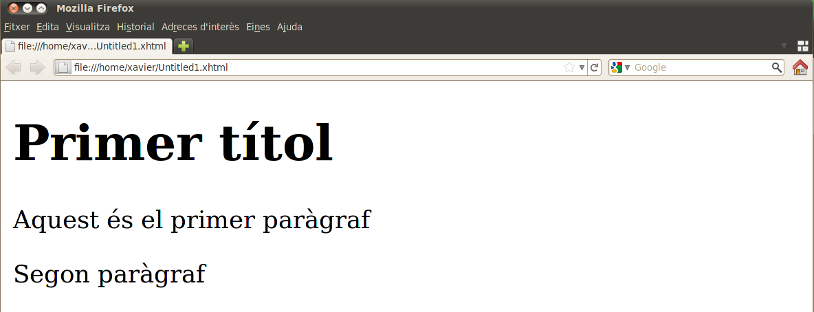
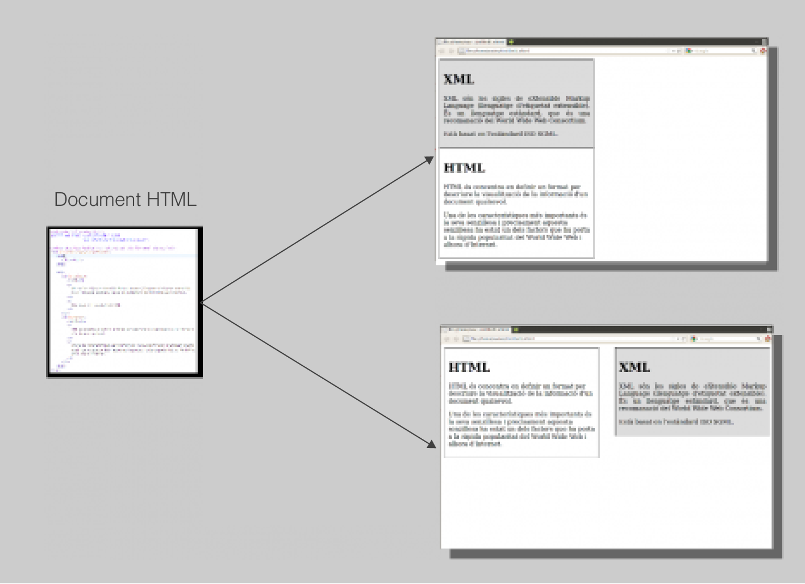

# Elements d'HTML
{: .no_toc }

1. TOC
{:toc}

## Títols

Es poden definir títols fent servir les etiquetes `<h1>`, `<h2>`,`<h3>`, `<h4>`, `<h5>` i `<h6>`. Aquestes etiquetes 
serveixen per definir diferents nivells de títols en un document.

Els navegadors, en carregar un document HTML, ja “comprenen” per defecte quin és el significat dels diferents nivells 
de títols i els representen convenientment: amb mides diferents i amb un salt de línia després.

```html
<h1>Primer títol</h1>
<h2>Segon títol</h2>
<h3>Tercer títol</h3>
<h4>Quart títol</h4>
<h5>Cinquè títol</h5>
<h6>Sisè títol</h6>
```


## Paràgrafs 

Una de les parts bàsiques que formen un document solen ser els paràgrafs, que en HTML es defineixen fent servir 
l’etiqueta `<p>`.

Per defecte els paràgrafs acaben amb un salt de línia encara que no s’indiqui explícitament en el document.

```html
<h1>Primer títol</h1>
<p>Aquest és el primer paràgraf</p><p>Segon paràgraf</p>
```



## Agrupació de contingut 

Quasi sempre, els títols i un nombre determinat de paràgrafs d’un text estan lligats per un contingut semàntic comú. 
Però com que la representació de les dades pot reordenar el contingut del document cal algun sistema per mantenir 
aquestes parts unides.

L’HTML permet agrupar continguts que tenen algun tipus de lligam per mitjà de l’etiqueta `<div>`.

```html
<div>
        <h1>Titol 1</h1>
        <p>Contingut de text</p>
        <p>Més contingut de text</p>
    </div>
```
Generalment els elements `<div>` se solen identificar per mitjà d’atributs `id` o class `perquè` el full d’estil hi 
pugui fer referència de manera més senzilla.

Un cop es té el contingut agrupat convenientment es farà més fàcil per als fulls d’estil presentar el document 
reordenant els continguts d’un document sense que se’n perdi la coherència interna.



## Ressaltar text

Hi ha tota una sèrie d’etiquetes més que tenen diverses funcions per a parts concretes del text:

* Definir text com a citacions: `<blockquote>`, `<q>` i `<cite>`.
* Marcar que s’ha de donar èmfasi a una part del text: `<em>` i `<strong>`
* Definir contingut com abreviacions, acrònims i definicions: `<abbr>`, `<acronym>`, `<dfn>`
* Permetre l’entrada de text preformatat: `<pre>` i `<code>`

Però moltes d’aquestes etiquetes poden ser substituïdes per l’etiqueta `<span>`. L’element `<span>` aporta una manera 
de separar lògicament contingut dins d’un paràgraf. Gràcies a aquesta separació es podrà donar un format diferent a 
parts del seu contingut.

Per defecte els navegadors representen les etiquetes `<span>` com a text normal, de manera que si volem que el text 
tinga un format diferent del normal se li haurà d’assignar per mitjà d’un full d’estil. És per aquest motiu que 
gairebé sempre s’hi afegeix un atribut `id` o `class`.


Per exemple, si es volguera mostrar el text tal com apareix a la figura anterior, es podria definir la part que ha de ser 
en negreta envoltant-la amb `<span>` d’aquesta manera:

```html
<h1>Cicles formatius de formació professional</h1>
<p>dimarts, 12 d'abril de 2011 12:23</p>
<p>Els cicles formatius són els ensenyaments que preparen per a l’exercici d’una 
professió determinada; s’agrupen en famílies professionals i poden ser de 
<span class="negreta">grau mitjà</span> o de <span class="negreta">grau superior</span>.
</p>
```

I posteriorment, en el full d’estil, definint que es vol negreta en la classe `negreta`.

## Imatges

Les imatges són un dels elements importants en les pàgines web. Podem classificar les imatges que trobem en una pàgina 
web en dos grans grups:

* **Imatges d’adornament**: no són essencials per al contingut de la pàgina, simplement hi són per millorar-ne la 
presentació. Per tant, s’haurien de carregar des del CSS.
* **Imatges de contingut**: formen part del contingut de la pàgina. Per tant, s’han de definir en el document.

És important saber que les imatges no s’afegeixen realment al document sinó que en aquest només s’hi desa una 
referència al lloc on les podem trobar via una URL.

Per definir imatges en un document es fa servir l’element ``, que té dos atributs obligatoris:

* L’atribut `src`, en què s’especificarà l’URL de la imatge.
* L’atribut `alt`, que contindrà un text que visualitzaran els programes que accedisquen al document HTML però no 
tinguen capacitat gràfica per mostrar imatges.

>En HTML l’etiqueta `` no cal que siga tancada però en XHTML ho ha d’estar per força.

Per tant, es pot fer que aparega una imatge en qualsevol document HTML definint la imatge amb una línia com aquesta:

```html

```
## Llistes

Les llistes són una altra manera de representar la informació en HTML. Hi ha tres tipus de llistes disponibles:

* Llistes numerades
* Llistes no numerades
* Llistes de definicions

Les llistes numerades permeten especificar una sèrie de valors precedits per un nombre. Aquestes llistes comencen 
amb l’etiqueta `<ol>` i després cada un dels elements de la llista es col·loquen en un `<li>`.

En les llistes no numerades cada un dels elements de la llista està precedit per un símbol, que per defecte és un 
cercle. Es comença la definició per `<ul>` i posteriorment els elements es posen dins d’un `<li>`.

Les llistes de definició són les menys conegudes però permeten especificar dos valors per cada element: un per a un 
terme o una frase, i l’altre per a la definició. En aquestes llistes es comença la llista per `<dl>`, els termes per
  `<dt>` i la definició per `<dd>`.


## Taules
A vegades la presentació de dades requereix que aquestes siguin formatades en taules. L’HTML permet la definició de 
taules amb tot un grup d’etiquetes.

Les taules sempre es consideren un grup de files en què cada fila té unes quantes caselles. Hi ha un grup més 
d’etiquetes per representar capçaleres, peus de taula, unir caselles, però la idea sempre es basa en el mateix.

Les etiquetes bàsiques per representar les taules són tres: `<table>` per marcar l’inici d’una taula, `<tr>` per crear
 files, i la que representarà cada una de les cel·les dins d’una fila, `<td>`.

El codi següent ens crea una taula de dues files i dues caselles a cada fila:

```html
<table>
  <tr>
    <td>1</td>
    <td>2</td>
  </tr>
  <tr>
    <td>3</td>
    <td>4</td>
  </tr>
</table>
```
En ser representat, aquest codi ens donarà un document com el que es mostra a la figura següent
 (s’hi han afegit les línies per poder visualitzar-ne millor el resultat).


{: .alert .alert-activity}
<div markdown="1">

### Document XHTML1.1
{: .nocount .no_toc }

Converteix el següent document en pdf en un document XHTML 1.1. 

[Joan Miró, article de la Viquipèdia](assets/Joan_Miro.pdf)

[Joan Miró, article de la Viquipèdia, text](assets/joan-miro.txt)

Com que l'objectiu és utilitzar el validador de XHMTL caldrà que empre l'esquelet d'un document XHMTL 1.1 que trobareu
al text. 

</div>


## Webgrafia i recursos
1. [Utilització dels llenguatges de marques en entorns web](https://ioc.xtec.cat/materials/FP/Recursos/fp_asix_m04_/web/fp_asix_m04_htmlindex/WebContent/u2/a1/continguts.html)
2. [Markup Validation Service](https://validator.w3.org/#validate_by_upload+with_options)
3. [HTML Tutorial, W3schools](https://www.w3schools.com/html/default.asp)
4. [Guía de referència XHTML](https://www.w3c.es/Divulgacion/GuiasReferencia/XHTML1/)
5. [Introducción a XHTML, librosweb](https://uniwebsidad.com/libros/xhtml)