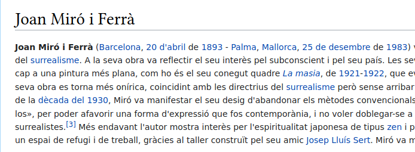

# Elements d'HTML (i 2)
{: .no_toc }

1. TOC
{:toc}

## Elements en bloc i elements en línia
Els elements, en HTML usualmente són elements "en bloc" o elements "en línea". Un element en bloc ocupa tot l’espai 
del seu element pare (contenidor), creant així un "bloc".

Per contra, un element en línia ocupa només l’espai delimitat per les etiquetes que defineixen l’element en línia.

Hi ha un parell de diferències clau entre els elements en bloc i els elements en línia:

1. *Formateig*. Per defecte, els elements de bloc comencen en una nova línia, però els elements en línia poden començar
 en qualsevol part d'una línia.
2. *El model de contingut*. En general, els elements en bloc poden contenir elements en línia i altres elements en bloc. 

Alguns elements en bloc són: h1, p, blockquote, div, etc. i en línia: a, cite, q, etc.

{: .alert .alert-activity}
<div markdown="1">

### Activitat 2. Peu d'imatge
{: .nocount .no_toc }

Mitjançant un element `div` afig el títol a les imatges
</div>
   
## Enllaços

La possibilitat que els documents s’enllacen entre ells ha estat un dels aspectes clau en la popularitat de les
pàgines web. L’objectiu dels enllaços és permetre tenir un apuntador unidireccional cap a una destinació qualsevol i 
que es puga accedir per mitjà d’una URL.

Hi ha diverses maneres de fer enllaços en HTML però la més corrent és l’etiqueta `<a>`. L’objectiu d’aquesta etiqueta 
és definir origen i destinacions dels enllaços.

L’únic obligatori que té aquesta etiqueta és `href`, que permet definir la destinació.

Les destinacions solen ser altres documents HTML.

```html
<a href="https://aules.edu.gva.es/fp">web d'Aules</a>
```
O documents d’altres tipus:

```
<a href="https://corriol.github.io/lmsgi/UD02/assets/Joan_Miro.pdf">Document</a>
```
O fins i tot es poden enllaçar punts dins del document mateix. Per fer-ho només s’ha d’afegir el nom d’un origen 
que s’hi haja definit i posar-hi el símbol `#` davant.

```html
<a href="#capitol1">Enllaç dins del document</a>
```

Els punts que poden ser destinacions dins d’un document es defineixen fent servir l’atribut `id` i un nom 
descriptiu únic. Per exemple, si es col·loca aquest codi en un document estem definint que puga ser enllaçat amb el 
nom capitol1.

```xhtml
<h2 id="capitol1" />Capitol 1</h2>
```

Tots els navegadors per defecte mostren els enllaços de manera diferent del text normal per facilitar que el lector
 els localitze ràpidament com en la imatge inferior.



{: .alert .alert-activity}
<div markdown="1">

### Activitat 3. Taula de continguts
{: .nocount .no_toc }

Mitjançant enllaços interns i una llista desordenada crea un taula de continguts baix del títol que et porte 
directament als encapçalats de nivell 2.

</div>
   


## Webgrafia i recursos
1. [Utilització dels llenguatges de marques en entorns web](https://ioc.xtec.cat/materials/FP/Recursos/fp_asix_m04_/web/fp_asix_m04_htmlindex/WebContent/u2/a1/continguts.html)
2. [Markup Validation Service](https://validator.w3.org/#validate_by_upload+with_options)
3. [HTML Tutorial, W3schools](https://www.w3schools.com/html/default.asp)
4. [Guía de referència XHTML](https://www.w3c.es/Divulgacion/GuiasReferencia/XHTML1/)
5. [Introducción a XHTML, librosweb](https://uniwebsidad.com/libros/xhtml)