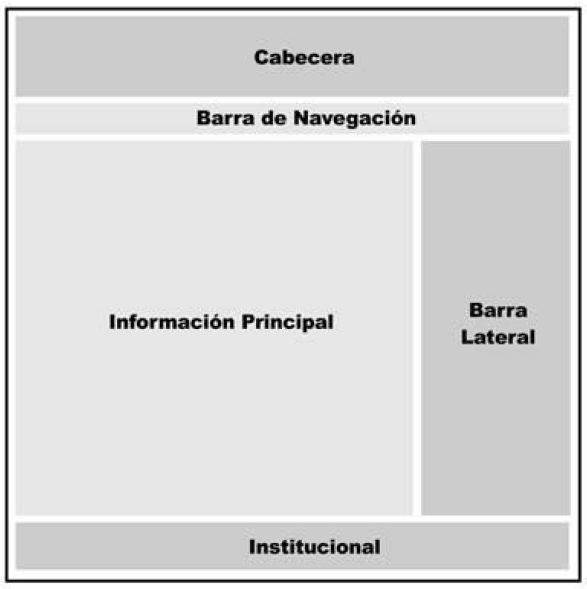
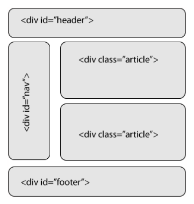
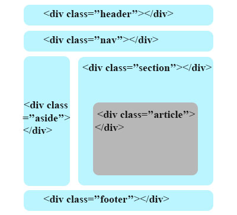

# Elements estructurals 
{: .no_toc }

1. TOC
{:toc}

## Introducció

La estructura del cos (el codi entre les etiquetes <body>) generarà la part
visible del document. Aquest és el codi que produirà la nostra pàgina web.
HTML sempre va oferir diferents formes de construir i organitzar la informació
dins del cos d’un document. 

Primerament va ser l'element `<table>`, el que es va emprar per a organitzar el contingut de les pàgines.
 Després va ser l'element <div> el que fins l'arribada d'HTML 5 va començar a dominar l’escena. El problema de l'element
 `<div>` és que no dona cap informació relativa al tipus de contingut que conté, en altres paraules, no té càrrega 
 semàntica. Per als usuaris no és important però sí ho és per als robots de búsqueda i per als navegadors.   

Després analitzarem els canvis que aporta HTML5 en aquesta qüestió però de moment treballarem 
en 'divs' per a organitzar el contingut.

A continuació veurem algun exemples d'organització:









{: .alert .alert-activity }
<div markdown="1">

### Activitat 5. Organitzar el contingut
{: .nocount .no_toc }

Modifica la pàgina `index.(x)html` de forma que tinga els següents elements:

1. Un `div` amb l'atribut class=”header” que contindrà en un h1 el text "Joan Miró" que serà un enllaç a index.(x)html.
2. Un `div` amb la classe ”footer” amb el text &copy; [El teu nom] 2020.
3. Un `div` amb la classe ”aside” que contindrà el menú.
4. Un `div` amb la classe ”main” que contindrà el contingut principal.

En acabar, descarrega't el full d'estils [global.css](assets/global.css) en la carpeta `estils` d'on tingues el lloc web. 

A més, inclou en el head del document el següent codi:

```html
<link rel="stylesheet" href="estils/global.css" />
```
</div>
   

