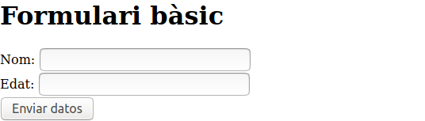
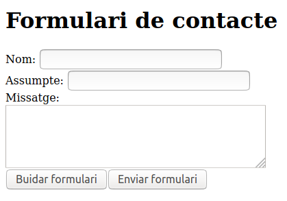
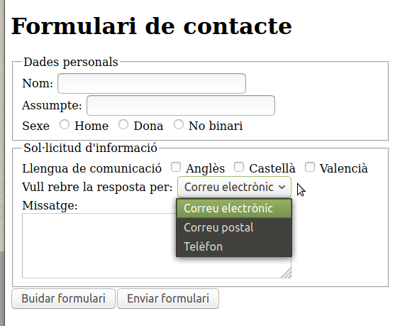

# Formularis 
{: .no_toc }

1. TOC
{:toc}

## Introducció

Els formularis HTML s'utilitzen per a enviar dades a un servidor. Un formulari HTML pot contenir elements d'entrada 
com camps de text, caselles de selecció, botons, etc.

Per crear un formulari HTML utilitzem l'etiqueta `<form>` i dins del `<form>`  introduirem els camps que ens 
interessen: `<input>`, `<select>`, etc.

Per exemple, el formulari senzill:



Seria:

```html
<?xml version="1.0" encoding="UTF-8"?>
<!DOCTYPE html PUBLIC "-//W3C//DTD XHTML 1.1//EN" "http://www.w3.org/TR/xhtml11/DTD/xhtml11.dtd">

<html xmlns="http://www.w3.org/1999/xhtml">

<head>
    <title>Exemple de formulari bàsic</title>
    <meta http-equiv="Content-Type" content="text/html; charset=utf-8" />
</head>

<body>
    <h1>Formulari bàsic</h1>
    <form action="processar-dades.php">
        <div>
            <label>Nom:</label>
            <input type="text" />
        </div>
        <div>
            <label>Edat:</label>
            <input type="text" />
        </div>
        <div><input type="submit" value="Enviar datos" />
        </div>
    </form>
</body>
</html>
```

Com es pot observar, les etiquetes `<form>` i `</ form>` delimiten el formulari, el qual conté en aquest exemple tres 
elements "input" perquè l'usuari puga:

1. Introduir el seu nom (dada de tipus text, `type="text"`).
2. Introduir la seva edat (dada de tipus nombre, `type="text"`).
3. Enviar aquestes dades, `type="submit"`.

A més, els elements `label` contenen el text associat a cada control de formulari.

D'altra banda, vegeu que a l'atribut `value` se li ha assignat el text que es mostra en el botó d'enviament, 
"Enviar dades".

### atribut `action`

Quan algú fa clic al botó d'enviament de dades d'un formulari, habitualment aquests són enviats a una altra pàgina web
 per al seu processament en un servidor. Per indicar l'URL d'aquesta pàgina, en l'element "form" s'utilitza l'atribut 
 `action`.

L'atribut `action` és obligatori i en l'exemple anterior les dades s'enviarien a la pàgina "processar-dades.php".


{: .alert .alert-info }
<div markdown="1">

### Llenguatges d'entorn servidor
{: .nocount .no_toc }
Nota: per processar les dades en un servidor s'utilitzen llenguatges que poden executar-se en un servidor, 
com ara: ASP, PHP, python, etc.
</div>

### atribut `method`

L'atribut method de l'element "form" permet especificar el mètode HTTP que es va a utilitzar per enviar les dades 
d'un formulari. Podent ser el mètode GET o el mètode POST.

El mètode GET se sol utilitzar per enviar informació (dades) que no sigui sensible (contrasenyes, telèfons, adreces de
 correu electrònic ...). Mentre que el mètode POST és l'habitual en els formularis. 

## Controls de formulari

Els controls de formulari són els diferents elements que permeten la introducció de les dades que després s'enviaran
al servidor. Aquests controls han de tenir obligatòriament l'atribut `name` que serà l'atribut al que s'associaran les 
dades introduides en cada element. 
 
En la següent pàgina teniu una informació més detallada 
[Introducción a XHTML, 8. Formularios](https://uniwebsidad.com/libros/xhtml/capitulo-8)


{: .alert .alert-activity }
<div markdown="1">

### Activitat 7. Formulari de contacte bàsic
{: .nocount .no_toc }

Crea en el lloc web sobre Joan Miró el següent formulari 


Assegura't que els tots elements on s'han d'introduir dades tinguen atribut `name`.

Utilitza l'element `label` de la forma que s'indica en l'apartat 8.3 de la Introducció a XHTML de Uniwebsidad

Valida la pàgina abans de penjar-la a Aules.
</div>

{: .alert .alert-activity }
<div markdown="1">

### Activitat 8. Formulari de contacte avançant
{: .nocount .no_toc }

1. Modifica el formulari perquè s'assemble al següent. La informació la trobareu en la _Introducció a XHTML_ de Uniwebsidad.


2. Assegura't que els tots elements on s'han d'introduir dades tinguen atribut `name`.

3. Utilitza l'element `label` de la forma que s'indica en l'apartat 8.3 de la Introducció a XHTML de Uniwebsidad

Valida la pàgina abans de penjar-la a Aules.
</div>