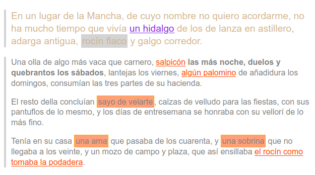

# Fulls d'estil en cascada (CSS)
{: .no_toc }

1. TOC
{:toc}

## Introducció
Introducció  a CSS. [Capítol 1.Introducció](https://uniwebsidad.com/libros/css/capitulo-1)

## Selectors
Introducció  a CSS. [Capítol 2.Selectors](https://uniwebsidad.com/libros/css/capitulo-2) 

{: .alert .alert-activity }

### Activitat 9. Selectors
{: .nocount .no_toc }

Afig al document HTML [css01.html](assets/css/css01.html) els selectors necessaris perquè l'aspecte del document
 siga com el de la imatge .

Valida la pàgina abans de penjar-la a Aules.

## Unitats de mesura i colors
Introducció  a CSS. [Capítol 3. Unitats de mesura i colors](https://uniwebsidad.com/libros/css/capitulo-3)

{: .alert .alert-activity }

### Activitat 10. Unitats de mesura i colors
{: .nocount .no_toc }

En el lloc web de Joan Miró canvia globalment:
 
1. La grandària de la lletra de l'`h1` de main a 1.3em i el color de la teua elecció;
2. La grandària de la lletra de l'`h2` de main a 1.1em i el color de la teua elecció;
3. La grandària de la lletra del paràgraf de footer a 0.8em i el color a _yellow_.
4. L'amplària (_width_) de `aside` a 23% i el farcit (_padding_) a 1%.
5. El marge esquerre (`margin-left`) de `main` a 25%.
6 .La grandària de totes les imatges a l'amplària de 50% i a l'alçada automàtica (auto).
7. La grandària de la lletra de les citacions llargues a 1.1em i el color gris (_gray_).
8. La grandària de la lletra dels paragràfs associats a les imatges a 0.8em. Hauràs de crear una classe.
9. El color de fons (`background-color`) de les capçaleres de les taules a un color clar de la teua elecció.
10. El color de fons (`background-color`) de les dades de les taules a un color clar distint a l'anterior.
11. El farcit (`padding`) de les capçaleres i les dades de les taules al 1%.

Valida la pàgina abans de penjar-la a Aules.

## Model de caixa
Introducció  a CSS. [Capítol 4. Model de caixa](https://uniwebsidad.com/libros/css/capitulo-4)

