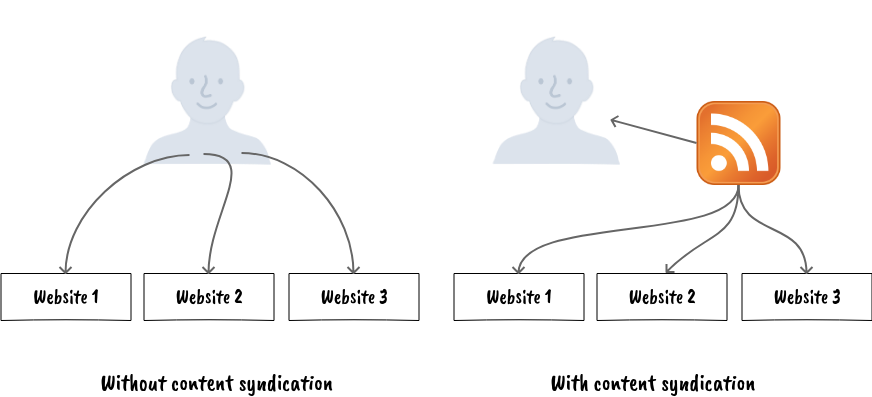
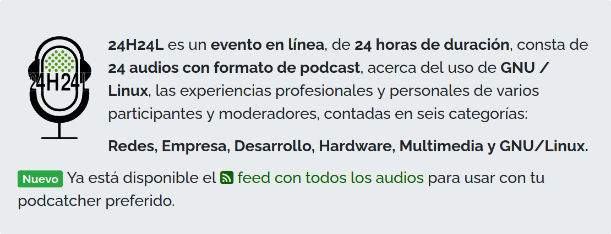
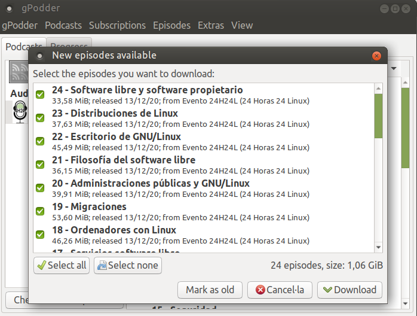
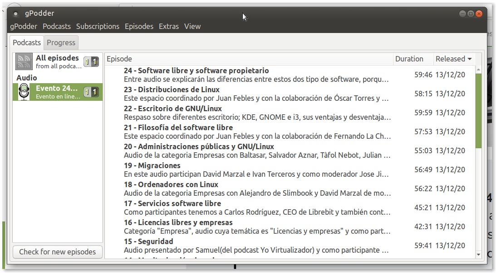

<!--
_backgroundColor: #369
_color: white 
_class: lead
-->
# Aplicació dels llenguatges de marques a la sindicació de continguts 
---

## Objectius
* Analitzar un exemple concret d’ús de llenguatge de marques per la transmissió d’informació.
* Definir un document XML basant-se en la seua sintaxi i estructura.
--- 
## Continguts 
1. Característiques de la sindicació de continguts.
   1. Avantatges.
   2. Àmbits d'aplicació.
2. Estructura dels canals de continguts.
   1. Funcionalitat i accés.
   2. Tecnologies de creació de canals: RSS, ATOM, etc.
   3. Validació.
   4. Utilització de ferramentes.
3. Directoris de canals de continguts.
4. Agregació.
---
<!--
_class: adjust
-->
## Criteris d'avaluació
* **S'han identificat els avantatges que aporten la sindicació de continguts a la gestió i transmissió de
la informació.**
* S'han definit els seus àmbits d'aplicació.
* S'han analitzat les tecnologies que es basen en la sindicació de continguts.
* **S'ha identificat l'estructura i la sintaxi d'un canal de continguts.**
* S'han creat i validat canals de continguts.
* Es comprova la funcionalitat i l'accés als canals.
* S'utilitzen eines específiques com a agregadors i directoris de canals.
---

## Introducció a la sindicació de continguts

* La sindicació (o redifusió) de continguts web consisteix que part del 
contingut d'una pàgina web es posa a la disposició d'altres llocs o 
subscriptors individuals en la forma de canals web.

* El programes consulten periòdicament els canals
que enllacen amb els articles complets en el lloc web original.

---



---
## Un poc d'història

* 1980–1991: Invenció i implementació
* 1991–1995: La web es fa pública, creiximent.
* 1995–2004: Comercialització, la bambolla _.com_, repercusions
* 2004–present: Ubiquitat i Web 2.0 
--- 

## Un poc d'història

La sindicació de continguts va canviar la manera com es recupera la
informació. Ja no calia anar a buscar la informació: ara la informació la que
acudia a l’usuari.

Un altre dels avantatges que aporta la sindicació és inherent a XML. Facilitat 
d'interpretar el contingut i de reutilització.

---
## La sindicació de continguts en l'actualitat

En l'actualitat, amb l'eclosió de les xarxes socials i l'aparició d'altres tecnologies,
l'ús de la sindicació de continguts amb formats estandards ha disminuit i la 
redifusió de continguts s'ha centrat en la publicació en xarxes socials i en
l'ús d'altres sistemes de comparticions com les API.

No obstant, en el món del _podcast_, continua usant-se com a forma automàtica de compartir continguts.

---
### Podcast

Un **podcast** és fitxer de ràdio, de so o de vídeo destinat a la difusió per podcàsting. 

El **podcàsting** fa referència a la tècnica per a crear i difondre arxius de so i de vídeo 
per Internet que permet que l'usuari puga descarregar-los al seu ordinador i escoltar-los
 o veure'ls quan vulga.

---

## Exemple d'ús 1/3



Mitjançant un _podcatcher_ podem descarregar els nous _podcasts_ publicats.

--- 

## Exemple d'ús 2/3

En afegir el feed (nom que rep la llista d'elements) ens mostra les novetats
que hi ha.



---
## Exemple d'ús 3/3

Una vegada afegit ja estem subscrits i el _podcatcher_ ens avisarà de les novetats.



---

**Activitat 1. Sindicació de continguts**

En la següent activitat instal·larem una agregador de RSS i ens subscriurem a alguns canals.

1. Instal·la el complement de Firefox: *Feedbro*.
2. Accedeix al complement.
3. Subscriu-te als següents canals:
   1. Els podcasts de l'esdeveniment 24h24l.org.
   2. Les últimes notícies de El País
   3. Les notícies de la Portada de El Mundo.   
4. Comprova si alguna de les pàgines que consultes habitualment fa redifusió dels seus continguts. Si és així subscriu-te al seu canal.

---

<!-- 
_class: lead
-->
# Estructura dels canals de continguts
---

## Els canals de contiguts

Els canals d'informació web (_feeds_, en anglès) permeten als programes comprovar 
si hi ha  actualitzacions publicades en un lloc web. Per proporcionar un canal web, 
el propietari del lloc pot utilitzar un programari especialitzat (com ara un
sistema de gestió de contingut) que publica una llista (o "feed") d'articles o 
contingut recents en un format estandarditzat de lectura automàtica. 

El canal es pot descarregar mitjançant programes que l’utilitzen, com ara 
llocs web que distribueixen contingut del feed, o mitjançant programes lectors de feeds 
anomenats *agregadors* que permeten als usuaris d’Internet subscriure’s a 
canals i veure’n el contingut.

---

## Els canals de contiguts

Un canal (_feed_) conté entrades, que poden ser titulars, articles de text complet,
extractes, resums o enllaços a contingut d’un lloc web juntament amb diverses metadades.

A continuació analitzarem les característiques dels dos estàndards, **basats en XML**, 
per a la creació de canals de continguts: RSS 2.0 i Atom 1.0.

---
## RSS 2.0

RSS (_RDF Site Summary_ o _Really Simple Syndication_) és un canal (_feed_) web que permet 
als usuaris i a les aplicacions accedir a actualitzacions de llocs web en un format
estandarditzat i llegible per ordinador. 

Va ser desenvoluat pel _RSS Advisory Board_ i la seua primera versió, RSS 0.90, aparegué en març de 1999.
La darrera versió, la 2.0, va apareixer en març de 2009.

---
## RSS 2.0

RSS és text pla amb format XML:

```xml
<?xml version="1.0" encoding="UTF-8" ?>
<rss version="2.0">
<channel>
 <title>RSS Title</title>
 <description>This is an example of an RSS feed</description>
 <link>http://www.example.com/main.html</link>
 <copyright>2020 Example.com All rights reserved</copyright>
 <lastBuildDate>Mon, 06 Sep 2010 00:01:00 +0000 </lastBuildDate>
 <pubDate>Sun, 06 Sep 2009 16:20:00 +0000</pubDate>
 <ttl>1800</ttl>

 <item>
  <title>Example entry</title>
  <description>Here is some text containing an interesting description.</description>
  <link>http://www.example.com/blog/post/1</link>
  <guid isPermaLink="false">7bd204c6-1655-4c27-aeee-53f933c5395f</guid>
  <pubDate>Sun, 06 Sep 2009 16:20:00 +0000</pubDate>
 </item>
</channel>
</rss>
```
---
## RSS 2.0

**Diagrama d'arbre del canal RSS**

 

---

Per a més detalls podeu accedir a l'especificació: 
[RSS 2.0 Specification](https://www.rssboard.org/rss-specification)

--- 

## Atom

El format de sindicació d’àtoms és un llenguatge XML que s’utilitza per a feeds web.

El format Atom es va desenvolupar com a alternativa a RSS. Ben Trott, defensor 
del nou format que es va convertir en Atom, creia que RSS tenia limitacions i defectes, 
com ara la manca d’innovació contínua i la seva necessitat de mantenir-se compatible, 
i que hi havia avantatges en un disseny nou.

Un document basat en el format Atom té la següent estructura:

---
## Atom

```xml
<?xml version="1.0" encoding="utf-8"?>

<feed xmlns="http://www.w3.org/2005/Atom">
  <title>Example Feed</title>
  <subtitle>A subtitle.</subtitle>
  <link href="http://example.org/feed/" rel="self" />
  <link href="http://example.org/" />
  <id>urn:uuid:60a76c80-d399-11d9-b91C-0003939e0af6</id>
  <updated>2003-12-13T18:30:02Z</updated>   
    
  <entry>
    <title>Atom-Powered Robots Run Amok</title>
    <link href="http://example.org/2003/12/13/atom03" />
    <link rel="alternate" type="text/html" 
      href="http://example.org/2003/12/13/atom03.html"/>
    <link rel="edit" href="http://example.org/2003/12/13/atom03/edit"/>
    <id>urn:uuid:1225c695-cfb8-4ebb-aaaa-80da344efa6a</id>
    <updated>2003-12-13T18:30:02Z</updated>
    <summary>Some text.</summary>
    <content type="xhtml">
      <div xmlns="http://www.w3.org/1999/xhtml">
        <p>This is the entry content.</p>
      </div>
    </content>
    <author>
      <name>John Doe</name>
      <email>johndoe@example.com</email>
    </author>
</entry>
</feed>
```
---

## Validació

Com que tant RSS com Atom són documents XML, es podrà comprovar que
són correctes fent servir les mateixes eines de comprovació que es fan servir
en XML.

Malgrat que és possible fer servir els validadors d’XML, el més normal és fer
servir programes específics per validar RSS i Atom com el _Feed Validation Service_ de W3C
 ([validator.w3.org/feed](https://validator.w3.org/feed))

 ---

## Solució
```xml
<?xml version="1.0" encoding="UTF-8"?>
<rss version="2.0">
<channel>
	<title>Receptari exemplar</title>
	<description>Blog sobre gastronomia de la Comunitat Valenciana</description>
  <link>https://receptari-exemple.org</link>
  <ttl>1800</ttl>

	<item>
		<title>Arròs al forn</title>
		<description>La peculiaritat d'aquest arròs, com indica el mateix 
    nom, és que està cuinat al forn. I, igual que la paella i altres arrossos 
    valencians, també és un plat d'origen popular, que en aquest cas s'elaborava 
    a partir de les restes del putxero. És per això que entre els seus ingredients 
    no falten els cigrons, les costelles de porc i la botifarra. Aquest plat 
    és especialment típic en comarques com la Costera, on a Xàtiva se celebra
     des de fa uns quants anys el Concurs Nacional d'Arròs al Forn.
     </description>
		<link>https://receptari-exemple.org/2020/12/arros-al-forn.html</link>
		<pubDate>Sun, 13 Dec 2020 08:00:00 +0000</pubDate>
		<guid isPermaLink="true">https://receptari-exemple.org/2020/12/arros-al-forn.html</guid>
	</item>
```

---
```xml
	<item>
		<title>Paella valenciana</title>
		<description>La paella és el màxim estendard de la cuina valenciana 
    i probablement també de l'espanyola, a causa del seu reconeixement 
    gastronòmic a escala mundial. El seu origen, com el de tots els plats 
    de la cuina popular, deriva de la conjunció dels aliments que cada família
     tenia al seu abast, especialment en la zona de l'horta de València, 
     que es proveïa de verdures fresques. A més, antigament era costum criar 
     pollastres i conills per a ús familiar, per la qual cosa, si a tot això 
     unim l'abundància de l'arròs conreat en l'Albufera, el resultat és
      aquest plat genuïnament valencià que rep el nom del recipient 
      en el qual es cuina.</description>
		<link>https://receptari-exemple.org/2020/04/paella-valenciana.html</link>
		<pubDate>Mon, 06 Apr 2020 13:20:00 +0000</pubDate>
		<guid isPermaLink="true">https://receptari-exemple.org/2020/04/paella-valenciana.html</guid>
	</item>

	<item>
		<title>Olleta</title>
		<description>L'olleta és el plat més representatiu a la zona de la muntanya 
    d'Alacant i a l'interior de València. Es tracta d'un putxero suculent, 
    similar a un potatge caldós però dels més refinats de tot Espanya, i per 
    això es reconegut a escala nacional. El seu sabor intens i perfumat deriva 
    de la fragància aromàtica dels embotits i, una vegada desgreixat, aconsegueix
     un punt sublim.</description>
		<link>https://receptari-exemple.org/2019/12/olleta.html</link>
		<pubDate>Sat, 28 Dec 2019 18:20:00 +0000</pubDate>
		<guid isPermaLink="true">https://receptari-exemple.org/2019/12/olleta.html</guid>
	</item>

</channel>

</rss>
```
