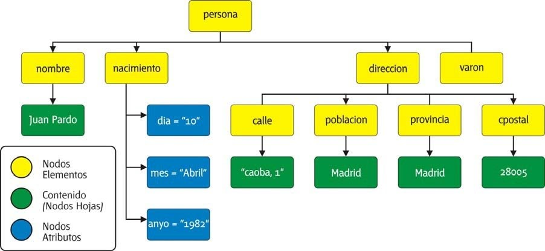
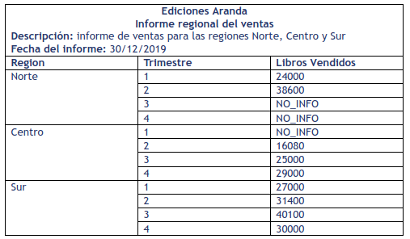

# DTD
## Què és DTD?

DTD (_Document Type Definition_, Definició de Tipus de Document) serveix per 
definir l'estructura d'un document SGML o XML: els elements, atributs, entitats, 
notacions, etc, que poden aparèixer, l'ordre i el nombre de vegades que poden 
aparèixer, quins poden ser fills de quins, etc., permetent la seva validació.

<div markdown="1" class="alert-info alert">
*  SGML (Standard Generalized Markup Language, Llenguatge de Marcat Generalitzat Estàndard). Vegeu: http://www.w3.org/MarkUp/SGML/.

* XML (eXtensible Markup Language, Llenguatge de Marcat extensible) és un llenguatge desenvolupat per W3C (World Wide Web Consortium) que està basat en SGML.

En http://www.w3.org/TR/xml/ es pot consultar la W3C Recommendation de XML, en la qual es fonamenta aquest tutorial, on s'explica -de forma introductòria a través d'exemples- com escriure i utilitzar DTD per validar documents XML.
</div>

Un document XML és vàlid (_valid_) quan, a més d'estar ben format, no incompleix cap de les normes establertes en la seva estructura.

Hi ha altres tecnologies que també permeten validar documents XML, com ara XML Schema o RELAX NG.

## Associar una DTD a un documento XML

S'indica mitjançant l'etiqueta DOCTYPE. La DTD pot estar inclosa en el propi document,
ser un document extern o combinar-dues.

```xml
<!DOCTYPE nombre [
     ... declaraciones ...
    ]>
```

```xml
   <!DOCTYPE nombre SYSTEM "uri">
```

```xml
<!DOCTYPE nombre SYSTEM "uri" [
   ... declaraciones ...
]>
```

La DTD també pot estar en un document extern si va a ser utilitzada per diverses 
aplicacions:

```xml
<!DOCTYPE nombre PUBLIC "fpi" "uri">
```
Es pot combinar una DTD externa amb una DTD interna, amb la sintaxi:

```xml
<!DOCTYPE nombre PUBLIC "fpi" "uri" [
     ... declaraciones ...
]>
```
En tots aquests casos:
- `nombre` és el nom del tipus de document XML, que ha de coincidir amb **el nom de l'element arrel** del document XML.
- `uri` és el camí (absolut o relatiu) fins a la DTD.
- `fpi` és un identificador públic formal (_Formal Public Identifier_).


<div markdown="1" class="alert-activity alert">
**Activitat. Associar una DTD externa**

```xml
<?xml version="1.0" encoding="UTF-8"?>
<!DOCTYPE pizzas [
   <!ELEMENT pizzas (ingredientes, tipos)>
   <!ELEMENT ingredientes (ingrediente)*>
      <!ELEMENT ingrediente (#PCDATA)>
         <!ATTLIST ingrediente coding ID #REQUIRED>
   <!ELEMENT tipos (tipo)*>
      <!ELEMENT tipo EMPTY>
         <!ATTLIST tipo nombre CDATA #REQUIRED>
         <!ATTLIST tipo ingredientes IDREFS #REQUIRED>
]>

<pizzas>
   <ingredientes>
      <ingrediente coding="HUE">Huevo</ingrediente>
      <ingrediente coding="CHA">Champiñón</ingrediente>
      <ingrediente coding="CHO">Chorizo</ingrediente>
      <ingrediente coding="CAL">Calabacín</ingrediente>
      <ingrediente coding="JAM">Jamón de York</ingrediente>
   </ingredientes>
   <tipos>
      <tipo nombre="Fantástica" ingredientes="CAL, CHA, ZAN"/>
      <tipo nombre="Sabrosa" ingredientes="CHA, CHO, JAM, HUE"/>
   </tipos>
</pizzas>
```
1. Guarda la DTD de l'exemple anterior en un arxiu anomenat `exemple.dtd`.
2. Associa al document XML la DTD i comprova que valida correctament.
3. Afig la pizza _prosciutto_. 
</div>


<div markdown="1" class="alert-activity alert">
**Activitat. Creació d'un arxiu XML basat en una DTD**

Emmagatzema en un document XML les dades de les películes següents:

* Wonder Woman 1984 (2020) 
* Skylines (2020) 
* News of the World (2020) 
* The Bourne Ultimatum (2007) 

basant-te en l'estructura indicada en el DTD [movies.dtd](exercises/movies.dtd).

Inclou com a mínim els tres actors/actrius principals.

</div>

<div markdown="1" class="alert-activity alert">
**Activitat. Crear un dtd a partir d'un esquema**

Per a l'esquema d'arbre següent: 



1. Proporciona una DTD que reflexe esta jerarquía suposant que naixement és 
un element opcional i hi ha almenys una adreça. 
2. Genera un fitxer XML que faça referència al DTD (de manera interna i externa) 
i continga almenys dos elements persona.
</div>


<div markdown="1" class="alert-activity alert">

**Activitat. Obtenir XML i DTD d'unes dades i requisits.***

Escriure la DTD i l'exemplar de document XML que permeta modelar les dades 
de vendes d'una editorial:


 
S'han de tenir en compte les següents consideracions:

* És obligatori que l'informe porte una data.
* S'ha de poder diferenciar la part de la capçalera de l'informe de la part amb les dades.
* Sempre han d'aparèixer les tres regions en l'informe, i cap més.
* Per a cada zona han d'aparèixer sempre els quatre trimestres, tot i que falte la informació sobre els llibres venuts.
* Si no s'inclou el nombre de llibres venuts en les dades, en l'informe apareixerà la cadena NO_INFO.
* El nombre de trimestre només pot prendre els valors 1, 2, 3 o 4.
</div>

## Crèdits i bibliografia 

En aquesta unitat usarem com a referència el llibre _Lenguajes de Marcas y Sistemas de Gestión de Información_ de Carlos Pes

* [Versió en línia](https://www.abrirllave.com/dtd/que-es-dtd.php)
* [Versió en PDF](https://www.abrirllave.com/lmsgi/libro.php)

i de Barlomé Sintes Marco:

* [https://www.mclibre.org/consultar/xml/lecciones/xml-dtd.html](https://www.mclibre.org/consultar/xml/lecciones/xml-dtd.html)
