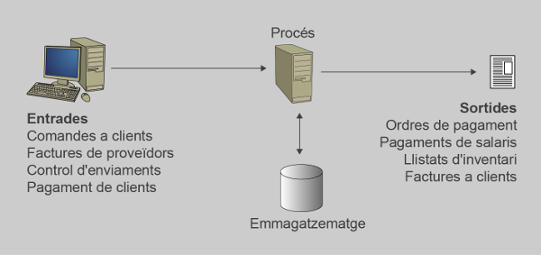
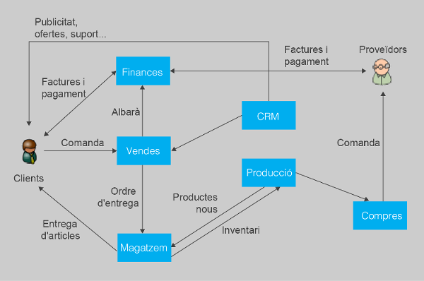
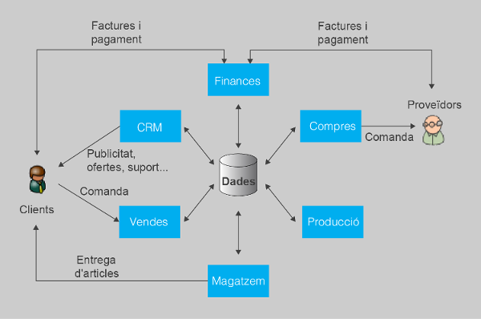
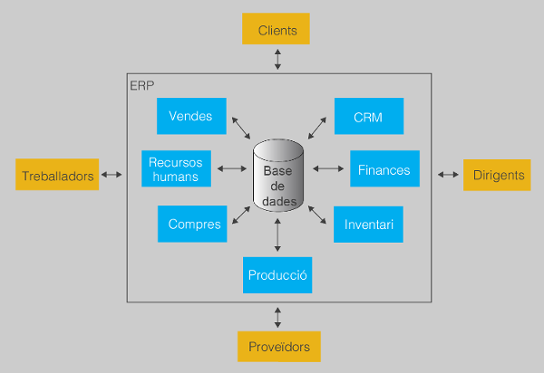
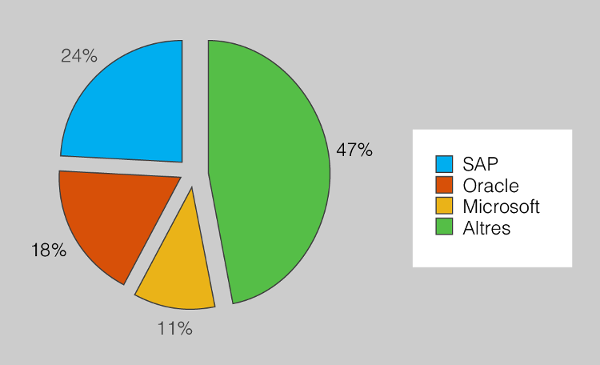
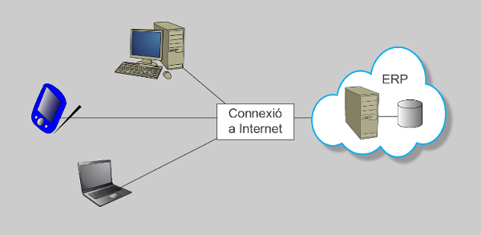

# Sistemes empresarials de gestió d’informació

## Objectius bàsics
Si bé inicialment els programes informàtics només es feien servir per agilitzar les
tasques de l’empresa, actualment tenen un paper fonamental en moltes empreses.
Essent molt generalistes podem dir que els sistemes informàtics s’han implantat
amb dos objectius bàsics:
* Facilitar les tasques als treballadors.
* Facilitar les preses de decisions dels dirigents.

És des d’aquest prisma que sovint es fan les valoracions sobre l’èxit o el fracàs de
la implantació d’un sistema informàtic en una empresa.

### Presa de decisions
Un dels objectius comuns en gairebé totes les organitzacions és obtenir i mantenir
un avantatge competitiu, que a la vegada proporciona un avantatge a llarg termini.
Això planteja un seguit de qüestions, com ara:
* S’ha d’invertir?
* S’ha de produir més?
* S’ha de contractar més personal?
* ...

Malgrat que totes les empreses són diferents, tenen en comú que aquest avantatge
competitiu sovint es basa en la presa de decisions en el moment adequat, i normalment en un curt espai de temps, ja que descobrir tard les necessitats del
mercat pot fer que algú altre se n’aprofiti i aconsegueixi posicionar-se i sigui molt
difícil competir-hi.
El fet que les decisions que es prenguin puguin afectar directament el futur de
l’empresa i que s’hagin de prendre en el moment adequat fan dels sistemes
informàtics un recurs valuosíssim per a qualsevol organització. Les decisions ja no
s’han de prendre per intuïcions ni de manera aleatòria, sinó basades en les dades
que es poden obtenir dels sistemes informàtics.
Podem dividir les dades en dos grans grups:

* Dades internes: generades per l’empresa mateixa, com ara nombre de
vendes, preus dels proveïdors i capacitat de producció de l’empresa.
* Dades de l’entorn: la situació del mercat, els competidors, la legislació...

El problema més gran rau en el fet que la societat de la informació està fent que
tothom rebi una gran quantitat de dades al dia i a pesar que moltes d’aquestes dades
són irrellevants per als objectius de l’empresa n’hi ha moltes que són o podrien
ser importants en la presa de decisions i per tant s’han de poder detectar.
Això fa que les empreses es vegin obligades a tractar una gran quantitat d’informa-
ció, i la gestió d’aquesta informació és una pràctica costosa tant en l’ús de recursos
com en persones.
Per aquest motiu els sistemes informàtics són bàsics per proporcionar els mecanis-
mes per destriar les dades que serveixen de les que no serveixen, per organitzar
i classificar les dades amb vista a obtenir la informació necessària en el moment
adequat.

### Facilitar les tasques

El fet que la informatització ha facilitat les tasques que havien de dur a terme els treballadors es veu molt clarament en el que ha passat en el procés de transaccions de les empreses. El procés de transaccions comprèn tota una sèrie de tasques rutinàries com control d’estocs, elaboració d’albarans, elaboració de factures, o comptabilitat que s’han de fer en una empresa i que abans requerien molts recursos per desenvolupar-se, com mostra la figura:

Abans de l’aparició de la informàtica, aquests processos, tot i que no solen ser complexos, consumien una gran quantitat de recursos: s’hi havia de destinar molt de personal, calia lloc per emmagatzemar les dades…

La informatització va agilitzar notablement aquests processos, alliberant molts dels recursos que es dedicaven al procés de transaccions per destinar-los a altres tasques. L’èxit va ser tan gran que actualment el procés de transaccions informatitzat està implementat en qualsevol empresa.

Els sistemes informàtics han contribuït i estan contribuint a fer les tasques **més ràpides i menys propenses a errors** i per tant permeten a les empreses reduir costos i oferir més bon servei. 

## Programari empresarial

Hi ha una gran i molt variada quantitat d’aplicacions que es poden fer servir en les empreses. Els programes que es fan servir en les empreses van des de programes d’ofimàtica fins a programes totalment especialitzats per a una empresa d’un sector concret.

    Per programari empresarial s’entén qualsevol tipus de programari que ajude 
    a mesurar o millorar la seva activitat.

És molt difícil fer una classificació del programari empresarial però una de possible és basar-se en quina és la idea base per crear-lo. Des d’aquest punt de vista podem dividir el programari que es fa servir per gestionar una empresa en:

 * Aplicacions genèriques.
 * Programari a mida.
 * Programari estàndard.
 * ERP (programari de gestió integrada o _enterprise resource planning_).

En general les empreses grans solen tenir un control més gran sobre tots els aspectes del negoci, mentre que les més petites tendeixen a tenir un programari amb funcions similars però amb un cost i funcions inferiors.

### Aplicacions genèriques

En les empreses també es fan servir tota una sèrie d’aplicacions que no estan desenvolupades específicament per a la gestió de l’empresa sinó que són de caràcter més general, com aplicacions ofimàtiques, navegadors web o programes de correu.

Aquestes aplicacions, tot i que no estan desenvolupades específicament per a la gestió de l’empresa, a vegades hi tenen un paper molt important; els navegadors web, per exemple, són vitals per a l’accés a alguns serveis web; o pel que fa a l’exportació de dades, se solen importar en algun paquet ofimàtic per fer estadístiques o anàlisi de resultats que no estan definits en el programa de gestió principal.

Fins i tot es donen casos d’empreses molt petites que poden fer servir programes genèrics com per exemple aplicacions ofimàtiques per portar un control simplificat de la seva activitat empresarial.

### Programari a mida

En els principis de l’adopció de la informàtica per part de les empreses el més corrent era que aquestes empreses definissin els seus sistemes informàtics fent un programa que s’adaptés perfectament al seu funcionament o a les seves necessitats.

El programari a mida consisteix a desenvolupar un nou programa informàtic que permeti informatitzar l’activitat de l’empresa.

La idea és contractar informàtics per desenvolupar un programa que permeti informatitzar les tasques de la gestió de l’empresa. Com que es tracta de programes específics per a l’organització, aquests programes s’adapten perfectament a les seves necessitats.

Però aquests programes també presenten una sèrie de problemes:

* S’ha d’analitzar amb detall el funcionament de l’empresa per comprendre perfectament què es vol fer.
* La implantació és un procés llarg i propens a errors, ja que el programa no s’ha provat abans.
* S’adapten tan bé a l’empresa que qualsevol canvi en el funcionament normalment provoca que també s’hagin de fer canvis en el programari. Això fa que aquest tipus de programari sigui molt car de mantenir.

### Programari estàndard

    El programari estàndard de gestió d’empreses és un programari desenvolupat 
    específicament per poder funcionar en la majoria d’organitzacions.

El programari estàndard està pensat específicament per fer tasques concretes en una empresa genèrica global o d’un sector concret. La idea que hi ha al darrere d’aquestes aplicacions és intentar abaratir els costos i minimitzar els errors que es produeixen en el desenvolupament d’aplicacions a mida oferint un paquet que faci les funcions tan genèricament com sigui possible perquè es pugui usar en diferents empreses.

    Tot i la semblança entre les tasques de les empreses, les petites especificitats
    que les fan diferents són les que les defineixen realment.

Tot i que les empreses són totes diferents, la realitat és que hi ha una part molt important de tasques que és comuna a totes. I gràcies a això es poden crear paquets genèrics que es poden reutilitzar en diferents empreses.

Aquest sistema permet:

* Abaratir molt els costos perquè el programari ja està desenvolupat i provat.
* Reduir el temps d’implantació del programari. Generalment n’hi ha prou amb entrar les dades i ja es pot començar a treballar.

Existeixen molts programes d’aquest tipus que normalment es concentren en les necessitats de les petites i mitjanes empreses, oferint en un sol paquet control d’estocs, punt de venda, comptabilitat i facturació.

Els inconvenients d’aquests programes estan en l’adaptació:

* Totes les funcions estan pensades per funcionar “en qualsevol lloc” i per tant no solen adaptar-se perfectament a les especificitats de cap empresa.
* Poden provocar que sigui l’empresa la que s’hagi d’adaptar al funcionament del programa i no al revés.

A més, a vegades els programes que s’adaptarien més bé als diferents departaments d’una empresa no són del mateix desenvolupador. Per exemple, es pot donar el cas que el programa de comptabilitat que va més bé sigui el de la companyia A, mentre que el de gestió de magatzem sigui el de la companyia B.

Tenir programari de diferents empreses generalment provoca tota una sèrie de problemes però normalment el més important és “com ho fem perquè els programes es comuniquin les dades entre si sense problemes?”

Fins i tot quan s’aconsegueix aquesta comunicació hi sol haver tota una sèrie de dades d’un programa que no es passaran mai a l’altre (sia perquè no les fa servir o perquè no li calen). I això genera el que anomenem _illes informàtiques_.

Es produeix una illa informàtica quan en una empresa hi ha diferents departaments que tenen les seves pròpies dades i només en comparteixen una part amb la resta de l’empresa.

A més s’ha de tenir en compte que els programes no són perfectes, i regularment s’hi solen detectar problemes, evolucionen, i en surten noves versions. Pot passar que una actualització d’algun dels programes faci que es generin problemes en l’intercanvi de dades amb els altres programes, que a partir d’una determinada funció es facin tasques de manera diferent…

Malgrat aquests inconvenients, el programari estàndard és una opció molt vàlida que s’està fent servir en la gestió d’una gran quantitat d’empreses petites i mitjanes.

### ERP

En el moment en què va fer falta unir les diferents aplicacions dels diferents departaments d’una empresa es va veure que tenir un sistema d’emmagatzematge únic milloraria l’eficiència de l’organització.

Els programaris de gestió integrada o _enterprise resource planning_ (ERP) van sorgir a partir dels sistemes industrials de planificació de recursos de fabricació o _material requeriment planning_ (MRP i MPR II) amb l’objectiu d’integrar tots els sistemes d’informació de les empreses en un de sol.

Evolució dels sistemes informàtics empresarials

El que fan els ERP és expandir el concepte d’MRP II a totes les àrees de negoci, des de finances i control de projectes fins a recursos humans.

    Els ERP són sistemes integrals per a la gestió de l’empresa. Es tracta d’un 
    programa integrat que permet avaluar i gestionar el negoci.

    Són sistemes de gestió d’informació que automatitzen moltes de les tasques 
    d’operació i producció dels negocis d’una empresa.

Estan _formats per diferents components o mòduls_ que ofereixen solucions a determinats processos de negoci i que es poden integrar lliurement per formar l’aplicació final. El funcionament modular permet a qualsevol empresa poder adaptar el programa als canvis i a les necessitats de cada moment, integrant-hi o eliminant-ne mòduls segons les noves necessitats.

A més, el fet de funcionar de manera modular permet que els ERP **es puguin adaptar a un conjunt diferent d’empreses i sectors** ja que cada empresa només cal que integri els mòduls que realment necessita.

Molts dels ERP, mitjançant algun tipus d’eines de desenvolupament, **permeten adaptar mòduls concrets a les necessitats** particulars de l’empresa.

La gran diferència entre els ERP i les aplicacions tradicionals està en el fet que els ERP intenten abastar tots els processos de l’empresa i no solament una part, com feien les aplicacions tradicionals. Això fa que es puguin **integrar totes les àrees i procediments de l’empresa en una sola aplicació** i permet obtenir-ne una visió global d’una manera més senzilla.

La integració de tots els aspectes del negoci en una mateixa aplicació fa que se **simplifiquin les comunicacions entre els processos**. Si partim d’un sistema tradicional els diferents departaments han d’establir múltiples comunicacions amb els altres departaments per poder fer la seva feina.

Comunicacions entre processos amb sistemes tradicionals

En canvi, amb un ERP, els mòduls no cal que es comuniquin amb els altres mòduls; simplement ho han de fer amb la font de dades comuna.

Els ERP són conscients de l’ús d’aplicacions de propòsit general en les empreses i solen estar pensats per interactuar amb paquets d’ofimàtica o navegadors.

Tampoc no han quedat aliens a l’explosió d’èxit que ha estat Internet:

* Pràcticament tots permeten que s’hi pugui treballar des de navegadors web (i eliminen així la necessitat de clients específics).
* S’integren perfectament amb els programes de correu electrònic i comencen a oferir integració amb xarxes socials o correu electrònic.

Comunicacions entre processos amb un ERP

### Característiques dels ERP

Simplificant molt podem dir que un ERP està format per dos components bàsics:

* Una base de dades centralitzada.
* Un grup de mòduls o aplicacions.

Esquema bàsic d’un ERP

### Base de dades centralitzada

Els ERP funcionen amb una base de dades centralitzada en què interactuen tots els programes de manera que les dades només s’emmagatzemen una sola vegada i mai no hi ha dades disgregades.

Aquest repositori central de dades garanteix que, com que la informació és en un sol punt, en qualsevol moment es pugui obtenir una imatge de l’estat en què es troba l’empresa. Això elimina la possibilitat de creació d’“illes informàtiques”.

També es minimitza l’intercanvi d’informació entre departaments i la possibilitat que algú treballi amb dades desactualitzades ja que la informació és la mateixa per a tothom.

### Mòduls

Els mòduls són un conjunt d’aplicacions que es poden integrar per formar el sistema de programari. És bastant habitual que cadascun d’aquests mòduls coincideixi amb les unitats funcionals de l’empresa (compres, vendes, inventari, finances…).

Per tant, un dels grans avantatges dels ERP respecte als altres sistemes és que amb un sol programa s’integra tota la gestió de l’empresa. Això porta avantatges associats:

* **El temps d’aprenentatge es redueix** ja que no cal aprendre com funcionen diferents entorns, perquè és el mateix en tots els programes.
* **El sistema es pot adaptar** a les necessitats de cada moment de l’empresa, afegint nous mòduls per fer noves tasques o canviant la manera en què funcionen els mòduls instal·lats.

Tots els mòduls comparteixen la informació que van generant amb els altres mòduls de manera que en qualsevol punt es pot obtenir informació fiable i veraç.

### Inconvenients

No tot són avantatges en els ERP; també tenen alguns inconvenients, com ara:

* **La implantació sol ser complexa** ja que cal que hi intervingui i s’hi impliqui tota la empresa. Hi ha nombrosos exemples d’implantacions d’ERP que han fallat perquè no s’ha implicat tota la empresa en la implantació o per resistències al canvi d’alguns departaments.
* És bastant habitual que la implantació de l’ERP comporti que s’hagi de **canviar la manera de funcionar d’algun procés** de l’empresa per adaptar-lo a la manera de fer-ho de l’ERP, o bé que s’hagi de reprogramar algun mòdul per adaptar-se al funcionament l’empresa. Tot això fa que les fases de desenvolupament i prova dels canvis que s’han dut a terme siguin més importants, i que per tant el temps d’implantació encara sigui llarg.

    Normalment el temps d’implantació d’un ERP en una empresa supera l’any.

Però hi ha altres factors que poden fer que el temps d’implantació sigui més llarg, com ara:

* Problemes en la integració de les dades existents en el nou sistema.
* Resistència d’alguns departaments al canvi.
* Problemes d’aprenentatge de les noves eines per part dels treballadors.

Un altre problema que s’ha de tenir en compte és que es passa a **dependre d’un sol proveïdor de programari**, i això converteix l’empresa en dependent del proveïdor i del seus **costos de llicències i de manteniment**, que sovint són importants.

Per tant, els ERP ofereixen molts avantatges però no són recomanables per a empreses que canviïn sovint o que siguin molt descentralitzades.

#### Tipus d'ERP

Mentre inicialment els ERP estaven pensats per funcionar en qualsevol empresa, independentment del sector en què treballaven, actualment es concentren més a adaptar-se per cobrir les necessitats de les petites i mitjanes empreses. D’aquesta manera han anat apareixent ERP destinats específicament a determinats sectors empresarials.

Es podria fer una classificació dels ERP des d’un punt de vista de les empreses a què van dirigits en:

* **ERP horitzontals**: aplicacions pensades per poder funcionar en qualsevol empresa.
* **ERP verticals**: aplicacions pensades per treballar en una activitat concreta.

#### ERP verticals

Un ERP vertical és una solució amb totes les funcionalitats estàndard com control de magatzem, compres, vendes o finances, però a més s’hi afegeixen les necessitats concretes d’un sector determinat i s’hi adapten.

Un dels motius pels quals els ERP horitzontals tenen un temps d’implantació tan gran és perquè resolen molt bé tot el que és generalista però no solen resoldre gaire bé aquelles parts que són més específiques d’un sector industrial en concret. És en aquest punt que els ERP verticals prenen força ja que, com que són adaptats per desenvolupadors amb coneixements sobre l’entorn i el negoci, el temps d’implantació es redueix considerablement.

En el cas dels ERP horitzontals, és corrent que el cost d’adaptació del programa sigui fins i tot superior al cost de les llicències, ja que calen moltes hores d’adaptació per aconseguir la integració amb l’empresa. En canvi, en el cas dels verticals, l’adaptació requereix pocs canvis i per tant el resultat final també té un cost inferior.

Tot i això, els ERP verticals tenen més tendència que els horitzontals a fer que sigui l’empresa la que s’hagi d’adaptar a l’ERP i no al revés; això acostuma a ser degut al fet que fa les coses d’una manera diferent de com es fan en l’empresa, i portar a terme un canvi en l’àmbit de desenvolupament eliminaria l’avantatge de tenir un ERP vertical.

### Principals programes d'ERP

No hi ha cap ERP perfecte i tots tenen punts forts i punts febles, i per tant un dels aspectes fonamentals perquè la implantació d’un ERP tingui èxit en una empresa és triar-lo adequadament.

Hi ha diversos productes ERP disponibles en el mercat, entre els quals destaquen els oferts per les tres grans empreses desenvolupadores d’ERP: SAP AG, Oracle i Microsoft. Però hi ha moltes més solucions, com les que integren les empreses Sage (molt populars pels productes Contaplus o Facturaplus), Epicor, IFS o Ross (figura.6).

Distribució dels ERP en el mercat l’any 2011 segons Panorama Consulting Group

Els ERP més populars són:

* SAP R/3.
* Oracle e-Bussines Suite.
* Oracle JD Edwards.
* Oracle Peoplesoft.
* Microsoft Dynamics.
* Epicor ERP.
* Sage.
* Infor ERP.
* Lawson M3 ERP.

### Codi obert

També en el món del programari lliure s’hi pot trobar programari ERP, els fabricants del qual sovint aconsegueixen els ingressos per mitjà de l’oferta de serveis als clients.

Entre els programes ERP de codi obert destaquen:

* OpenBravo.
* OpenERP.
* Compiere.
* ADempière.
* Opentaps.

El codi obert ofereix unes característiques extres que sempre s’han de tenir en compte a l’hora de valorar si cal implantar aquestes solucions o no:

* **L’avantatge més clar és el preu**. Els ERP de codi obert es poden aconseguir sense cap mena de cost i per tant es redueixen els costos d’implementació i les llicències d’usuari.
* **No crea cap dependència d’un proveïdor informàtic** ja que el programari passa a ser controlat per l’empresa i es pot fer servir per crear un ERP propi amb molts menys recursos dels necessaris en un sistema de pagament.
* Com que disposa del codi **les possibilitats d’adaptació del programa a les necessitats de l’empresa són màximes**. Les solucions de pagament generalment permeten personalitzar els mòduls però sempre dins d’uns límits. En el cas dels sistemes de codi obert aquests límits no existeixen.

Però el programari lliure no és exempt de problemes, la qual cosa fa que moltes empreses no s’atreveixin a fer-los servir:

* No sempre hi ha prou documentació del funcionament dels programes. Això pot incrementar el temps d’aprenentatge.
* Les actualitzacions del programari solen ser imprevisibles i no sempre es documenten els canvis que es fan.
* Els projectes a vegades desapareixen. La desaparició d’un projecte normalment acaba obligant a canviar de producte.
* A pesar que gairebé tots ofereixen el producte lliure però amb una versió de pagament on s’inclou suport, en alguns casos el suport no sol ser tan important com el que s’ofereix en el cas del programari propietari.

Els ERP de codi obert són una alternativa totalment vàlida i que s’ha de valorar a l’hora de triar quin és l’ERP que s’adapta més a les necessitats de l’empresa, però sempre tenint en compte les fortaleses i les debilitats que té.

### Informàtica en núvol

La majoria d’aquests ERP s’estan adaptant o ja s’han adaptat per poder funcionar en el que es coneix com a _informàtica en núvol_ o més concretament com a _SaaS_ (_software as a service_).

La idea és no haver de fer cap mena d’instal·lació de programari en els servidors de l’empresa sinó accedir al programa per Internet, normalment amb un navegador web. Això permet que les tasques d’instal·lació i manteniment s’externalitzin, ja que és el proveïdor el que se n’encarregarà.

ERP en núvol

Aquesta característica permet:

* **Fer servir el programa sense haver d’instal·lar cap programari**, ja que aquest programari està instal·lat en els servidors del venedor.
* Que no sigui necessari per a l’empresa **fer cap mena de despesa en infraestructura de maquinari** (no cal comprar un servidor, implementar mecanismes de còpia de seguretat…) **ni en personal informàtic qualificat**. N’hi ha prou amb un ordinador i una connexió a Internet per poder treballar amb l’ERP.

Generalment el cost d’aquest tipus de serveis **es paga via subscripció**, la qual cosa implica un preu molt inferior al que es demana per comprar el paquet de programari i el lloguer dels tècnics responsables de la instal·lació.

Funcionar d’aquesta manera garanteix que el programari sempre està actualitzat ja que l’empresa desenvolupadora s’encarrega de fer-ho en els seus propis servidors. No cal que l’empresa prengui riscos ni tingui despeses extres fent actualitzacions en els seus servidors.

Però sempre s’ha de tenir en compte que treballar d’aquesta manera implica uns riscos:

* Requereix que hi hagi una connexió permanent a Internet i per tant fa més dependent l’empresa de la companyia de telefonia.
* Una fallada en els servidors de l’empresa allotjadora pot provocar que s’aturi completament el funcionament de l’empresa ja que no es pot accedir al programa que ho gestiona tot.
* Com que les dades estan emmagatzemades en un lloc remot, en cas de problemes no és possible recuperar-les.

A més, l’ús de serveis en núvol **pot comportar problemes legals** ja que les dades deixen d’estar emmagatzemades en l’empresa per passar a estar-ho en els servidors del proveïdor, i a vegades aquests proveïdors no són en el mateix país en què treballa l’empresa.

Per tant es pot infringir la llei de Protecció de Dades de Caracter Personal (LOPD) a causa de les limitacions imposades en l’ubicació d’emmagatzematge ja que entre les dades amb les que treballa l’empresa n’hi sol haver de caràcter personal.

    La LOPD defineix entre altres coses en quins casos es pot permetre a un tercer 
    accedir a les dades d’una organització o quines condicions s’han de complir 
    per moure les dades d’un país a un altre.

Això obliga, abans de contractar un servei en núvol, a assegurar-se que l’empresa proveïdora del servei garanteixi que les dades que seran emmagatzemades en els seus servidors es desaran sense infringir la llei.

### Implantació d'un ERP

Els ERP són programes complexos d’implantar i no és rar que la implantació en una empresa pugui esdevenir un fracàs. Des d’un punt de vista empresarial un fracàs pot passar perquè calgui molt més temps o diners del que s’havia previst per implantar una determinada solució, perquè aquesta solució no funcioni com ho hauria de fer, que no es faci servir perquè és massa complicada o perquè no hi hagi confiança en les dades obtingudes.

En el mercat hi ha centenars d’ERP amb característiques i preus diferents. És bàsic que abans de triar un ERP es tingui clar com és l’empresa i quines són les seves necessitats concretes. La tria adequada de l’ERP és un dels factors determinants perquè tingui èxit la implantació. Els ERP són programes molt específics, i que un ERP tingui èxit en una empresa no és garantia que tingui èxit en una altra, encara que les dues siguin semblants.

Els ERP no són un tipus de programari que es compra i s’instal·la i comença a funcionar sinó que requereix que sigui adaptat per usar-lo en l’empresa. Sempre cal un temps de parametrització i modificació dels ERP abans de poder fer-los servir. No n’hi sol haver prou amb instal·lar el programari, sinó que cal una fase per fer totes les adaptacions necessàries per poder engegar el sistema.

És rar que no s’hagi de modificar res en un ERP. Normalment sempre hi ha algun aspecte del funcionament que va més bé si es canvia, o que s’ha de canviar per força. Per exemple, les llistes de resultats normalment solen ser molt genèriques perquè es confia que es modificaran en la fase d’implantació.

Amb la implantació d’un ERP generalment el que es busca és optimitzar els processos de l’empresa i en aquest sentit és fàcil que també s’hagi de canviar algun dels processos actuals de l’empresa o bé hagi de desaparèixer. Per aquest motiu un dels factors clau en l’èxit de la implantació és que s’hi impliquin totes les àrees del negoci. La resistència dels usuaris acostumats a treballar d’una manera a canviar-la és un altre factor determinant perquè no hi hagi èxit en la implantació.

El temps d’adaptació varia segons diferents aspectes però generalment hi influeix sobretot quin ERP s’ha triat, quins són els mòduls que s’han d’implantar i la mida de l’empresa on s’implanta l’ERP. L’allargament del temps d’implantació sovint és un altre dels factors pels quals fallen les implantacions de l’ERP.

Un altre factor que sovint provoca molts problemes en la implantació d’un ERP és el traspàs de dades. Les empreses ja solen tenir molts programes i molt diversos per portar la gestió i generalment es requereix que es puguin connectar amb l’ERP i això a vegades és una tasca molt complexa.

Un factor que s’ha de tenir en compte és que no cal que l’ERP sigui implementat tot de cop ja que la naturalesa modular que té fa que es pugui implementar mòdul a mòdul, i generalment seguir aquesta estratègia sol tenir més garanties d’èxit.

Per fer l’adaptació normalment s’ha de recórrer a una empresa integradora que ajuda en la implementació de l’ERP i ajuda a l’empresa en els aspectes del negoci relacionats amb el canvi: maquinari, programari o procés de canvi. La tria d’una bona empresa integradora també és un factor determinant en l’èxit o la fallada de la implantació. La seva experiència i capacitat d’entendre l’empresa i d’adaptar adequadament l’eina és un altre factor determinant. 

**Activitat 1: ERP comercials**

En l'apartat d'ERPs apareix un llistat dels més populars, com que són dades de 
2011, investiga com han evolucionant els diferents productes.

**Activitat 2: Mercat dels ERP**

Busca en internet informació actualitzada sobre el mercat dels ERP. Compara-la amb
el gràfic dels apunts. Com ha evolucionat el mercat? Hi ha un ERP predominant?

**Activitat 3: ERP de codi lliure**

Investiga com han evolucionat els diferents ERP de codi lliure _open source_ que apareixen al llistat. 
Continuen sent lliures? El projecte s'ha abandonat? Ara són de pagament?

**Activitat 4: ERP verticals**

L’objectiu d’aquesta activitat és veure que els ERP verticals són molt presents en el mercat.

Localitzeu ERP verticals per a tres o quatre sectors d’activitat i definiu-ne les característiques

## Crèdits i bibliografia

* SALA, Xavier i MARTÍ, Carles *Llenguatges de marques i sistemes de gestió d’informació*. Departament d’Ensenyament, 2012